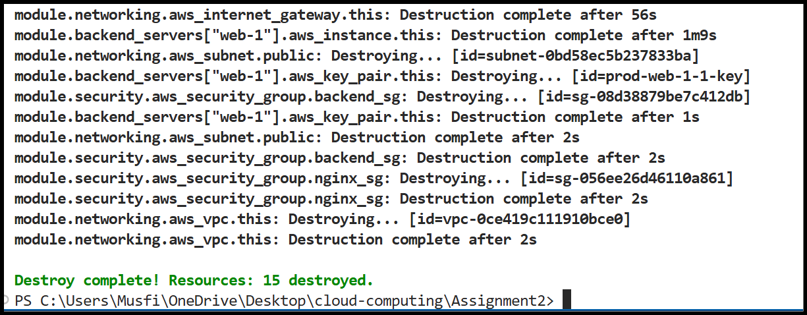

# 🌩️ Cloud Computing – Assignment 02  
## ☁️ Advanced Terraform & Nginx Multi-Tier Architecture (AWS)

**👩‍💻 Student:** Musfira Farooq  
**🎓 Roll No:** 2023-BSE-045  
**🏫 Department:** Software Engineering (BSE V-B)  
**👨‍🏫 Instructor:** Sir Muhammad Shoaib  

---

## 📌 Part 01 – Infrastructure Setup

### 🔹 Project Structure & Git Ignore
.png)  
.png)

### 🔹 Variables & Locals
.png)  
.png)  
.png)  
.png)

### 🔹 Networking Module
.png)  
.png)  
.png)  
.png)

### 🔹 Security Module
.png)  
.png)  
.png)

---

## 📌 Part 02 – Webserver Module

.png)  
.png)  
.png)  
.png)

---

## 📌 Part 03 – Server Configuration Scripts

### 🔹 Apache Backend
.png)  
.png)  
.png)

### 🔹 Nginx Setup
.png)  
.png)  
.png)  
.png)  
.png)

---

## 📌 Part 04 – Infrastructure Deployment

.png)  
.png)  
.png)  
.png)  
.png)  
.png)  
.png)

### 🔹 AWS Console Verification
.png)  
.png)  
.png)  
.png)

---

## 📌 Part 05 – Nginx Configuration & Testing

### 🔹 Backend & Reload
.png)  
.png)  
.png)  
.png)

### 🔹 Load Balancing
.png)  
.png)  
.png)  
.png)

### 🔹 Cache Testing
.png)  
.png)  
.png)  
.png)

### 🔹 High Availability
.png)  
.png)  
.png)  
.png)  
.png)

### 🔹 Security & Logs
.png)  
.png)  
.png)  
.png)  
.png)  
.png)

---

## 📌 Bonus Tasks

### 🔹 Custom Error Pages
.png)  
.png)  
.png)  
.png)

### 🔹 Rate Limiting
.png)  
.png)  
.png)

### 🔹 Health Check Automation
.png)  
.png)

---

## 📌 Part 06 – Documentation & Cleanup

.png)  
.png)  
.png)  
.png)  
.png)  
  
  
  

---
