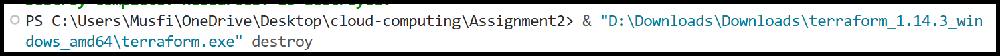
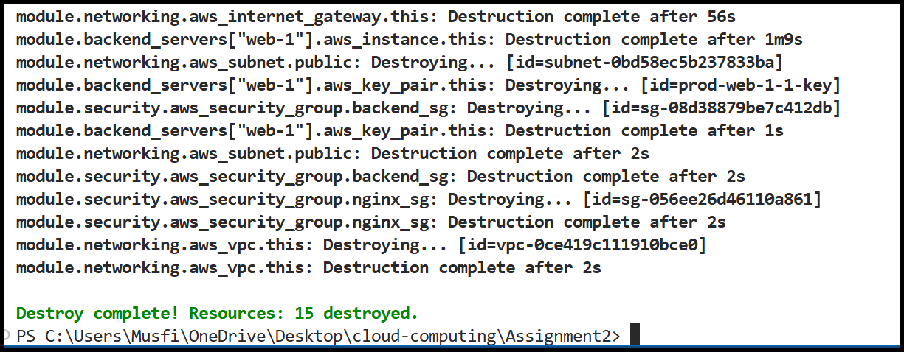
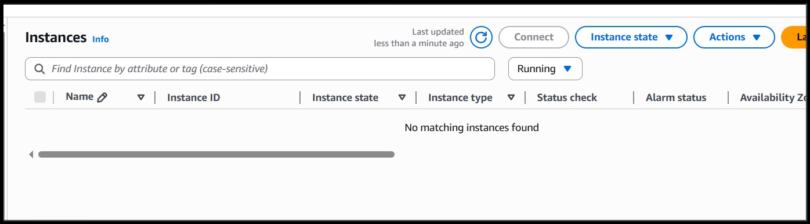
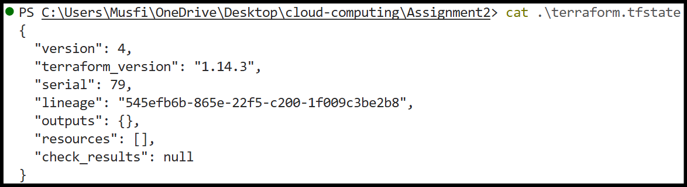

#this is link of my repo
https://github.com/Musfira-Farooq/CC_Musfira_BSE-045--Assignment2?authuser=0
 **SUBMITTED BY : MUSFIRA FAROOQ**
 **ROLL NO : 2023-BSE-045**
 **SUBMITTED TO:SIR WAQAS SALEEM**
            **ASSIGNMENT 02**
# Assignment 02 — Advanced Terraform & Nginx Multi-Tier Architecture

## Part 1 — Infrastructure Setup

### Project Structure
.png)

### .gitignore Configuration
.png)

### Variables Configuration
.png)
.png)

### terraform.tfvars
.png)

### Networking Module — main.tf
.png)
.png)

### Networking Module — outputs.tf
.png)
.png)

### Security Module
.png)
.png)

### AWS Security Groups (Console)
.png)

### Locals Configuration
.png)

---

## Part 2 — Webserver Module

### Webserver Module Variables
.png)

### Webserver Module main.tf
.png)

### Webserver Module outputs.tf
.png)

### main.tf Using Modules
.png)

---

## Part 3 — Server Configuration Scripts

### Apache Backend Script
.png)
.png)

### Backend Web Page
.png)

### Nginx Setup Script
.png)
.png)
.png)
.png)

### Default Nginx Page
.png)

---

## Part 4 — Infrastructure Deployment

### SSH Key Generation
.png)

### Terraform Init
.png)

### Terraform Validate
.png)

### Terraform Plan
.png)

### Terraform Apply
.png)

### Terraform Output
.png)

### Terraform Outputs JSON
.png)

### AWS VPC
.png)

### AWS Subnet
.png)

### AWS Security Groups
.png)

### AWS Instances
.png)

---

## Part 5 — Nginx Configuration & Testing

### SSH to Nginx Server
.png)

### Nginx Config Updated
.png)

### Nginx Test
.png)

### Nginx Restart
.png)

### SSL Certificate
.png)
.png)

### SSL Warning
.png)

### Web1 Response
.png)

### Web2 Response
.png)

### Load Balancing Demo
.png)

### Cache Miss
.png)

### Cache Hit
.png)

### Cache Directory
.png)

### Access Log Cache
.png)

### High Availability Test
.png)
.png)
.png)
.png)
.png)

### Security & Logs
.png)
.png)
.png)
.png)

---

## Part 6 — Documentation & Cleanup

### README Documentation
.png)
.png)
.png)
.png)
.png)

### Terraform Destroy

### AWS Instances Destroyed

---

## Bonus Tasks

### Custom Error Pages
.png)
.png)
.png)
.png)

### Rate Limiting
.png)
.png)
.png)

### Health Check Automation
.png)
.png)

---

## Extra

