# 🌩️ Cloud Computing – Assignment 01

### semester
BSE (V-B)

### Submitted By
- **Name:** Musfira Farooq  
- **Roll No:** 2023-BSE-045  

---

## 🧾 Assignment Overview
**Topics Covered:**  
Git • Gitea • GitHub • Git LFS • GitHub Pages  

This assignment demonstrates setup, configuration, and usage of version control and hosting tools.

---

## 🧩 TASK 01 — Run Gitea in Codespace and Create an Initial Repo

### 🔹 Gitea Running in Codespace
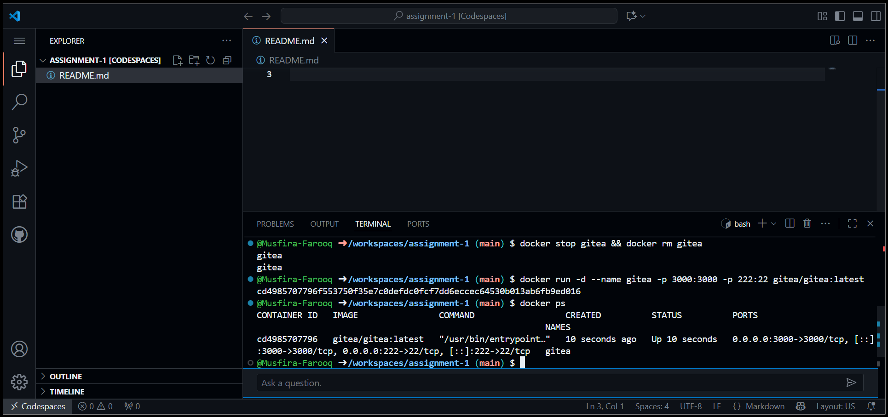

### 🔹 Connecting to Port 3000
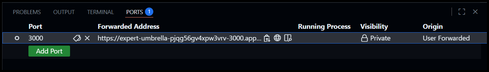

### 🔹 Installing Gitea in Codespace
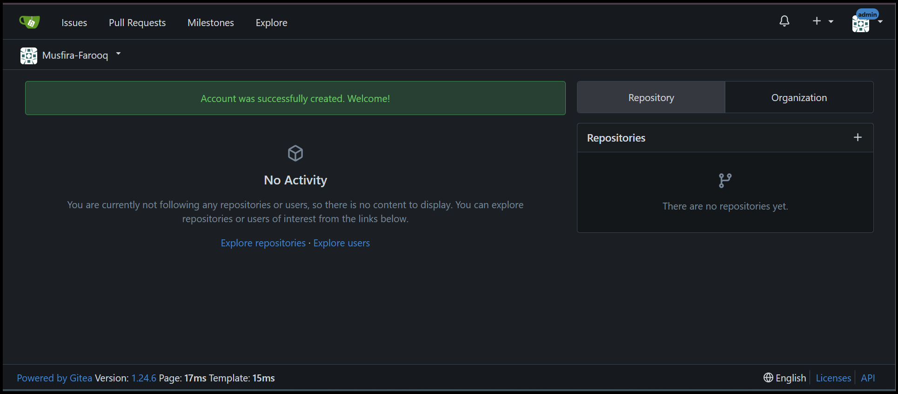

### 🔹 Gitea Repository with README.md
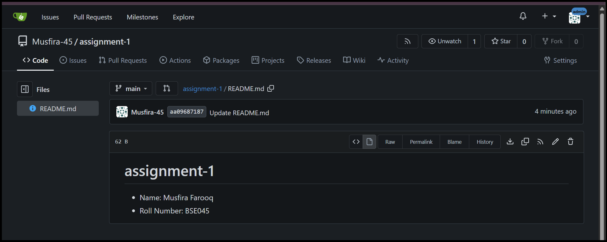

### 🔹 Adding Remote in Gitea
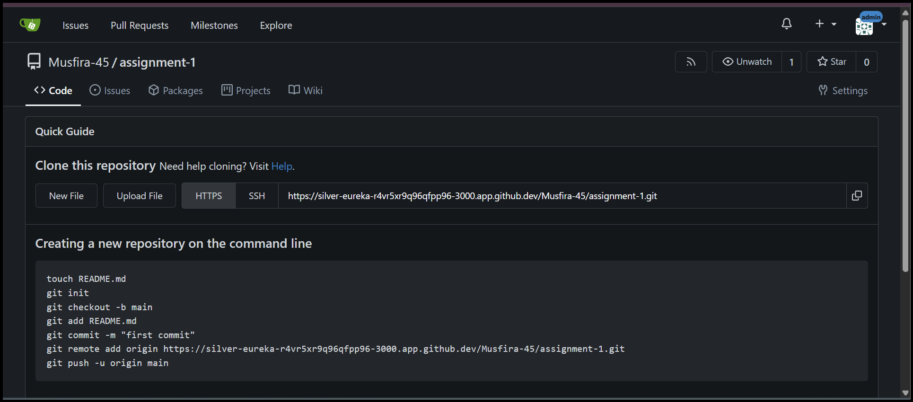

### 🔹 Gitea Settings
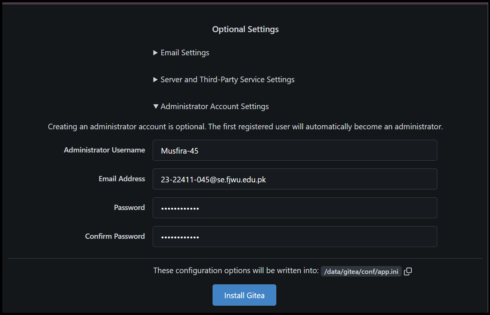

---

## 🔁 TASK 02 — Mirror README.md from Gitea to GitHub

### 🔹 Gitea Remote to GitHub
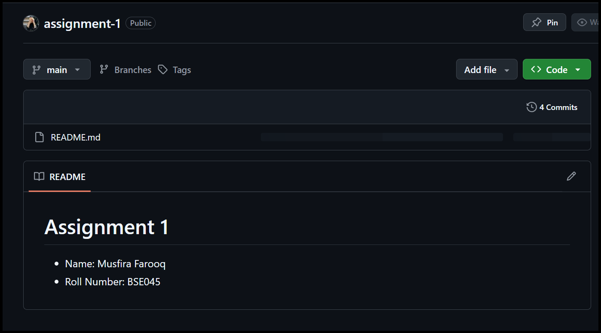

### 🔹 Gitea Mirrored into GitHub
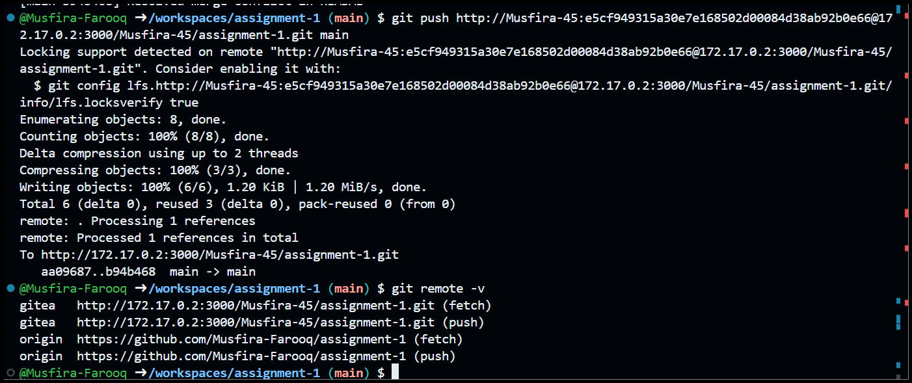

### 🔹 Editing README in Gitea
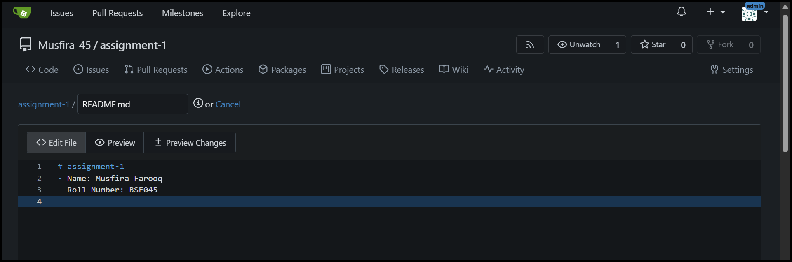

### 🔹 Remote Verification
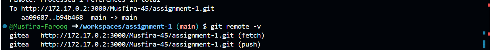

---

## 💾 TASK 03 — Use Git LFS for Large Files

### 🔹 Git LFS Installation and Tracking
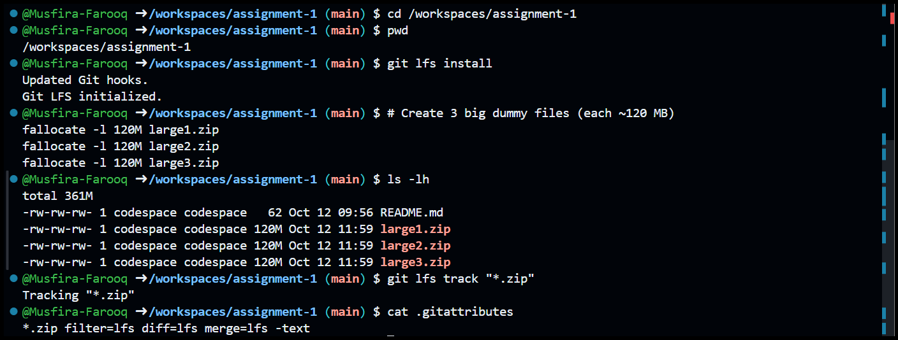

### 🔹 Verifying LFS Configuration
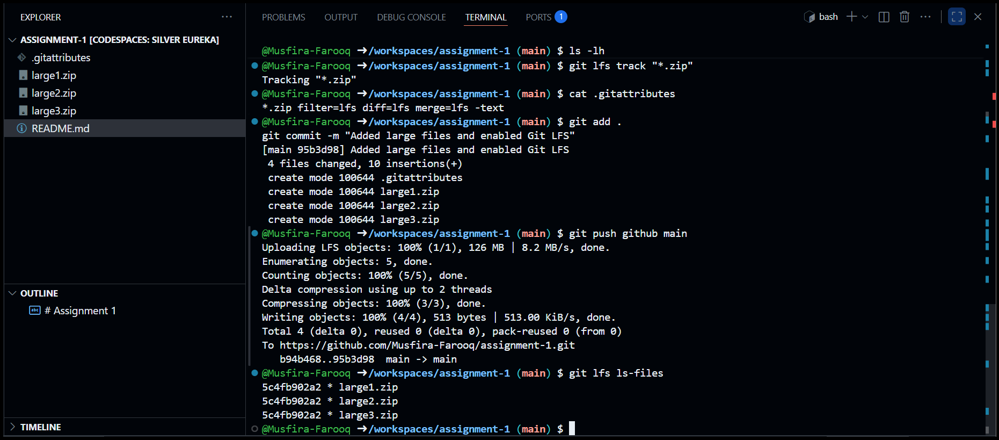

### 🔹 GitHub Repository Showing Large Files
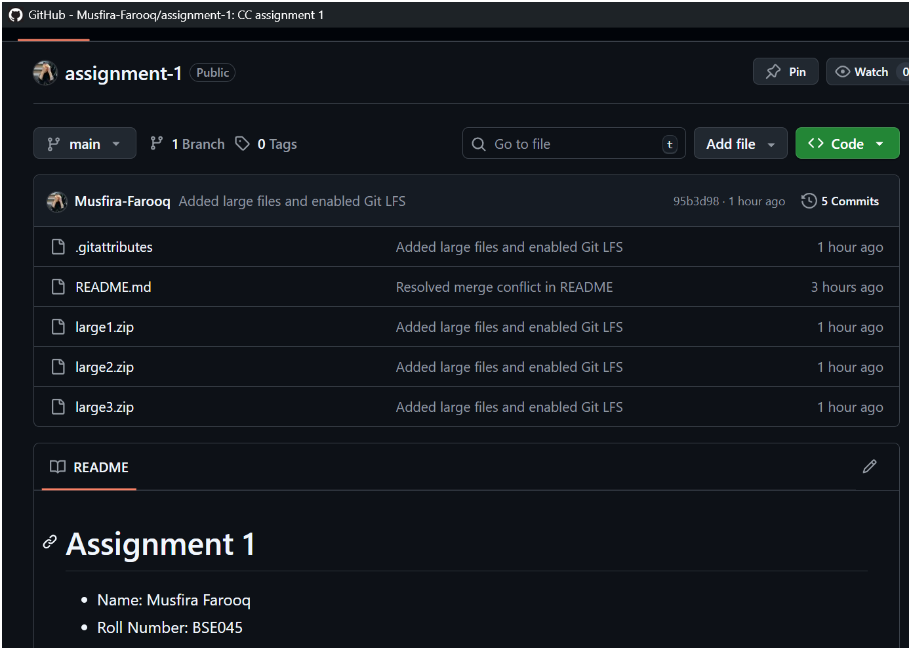

---

## 🌐 TASK 04 — Create a Portfolio/CV with GitHub Pages

### 🔹 Creating CV Repository
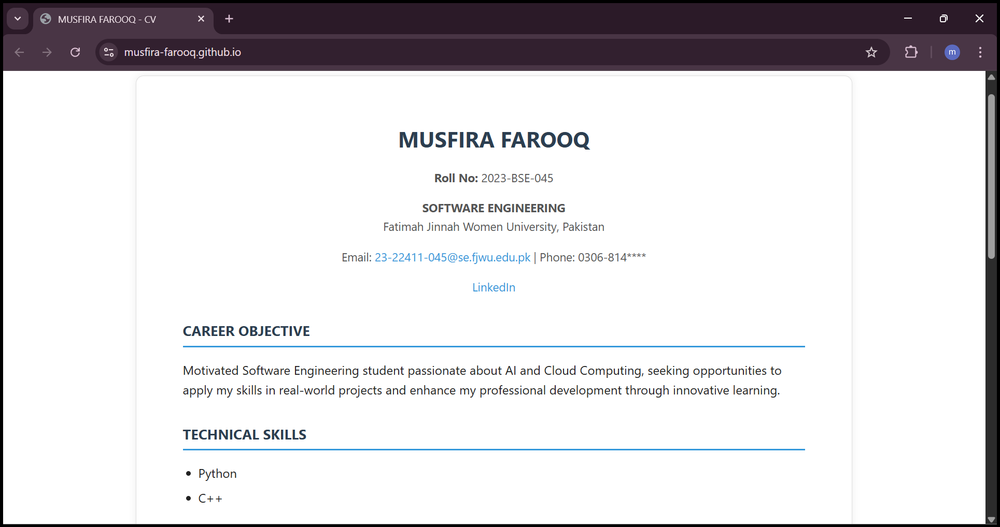

### 🔹 CV Live on GitHub Pages
.png)

### 🔹 GitHub Pages Settings
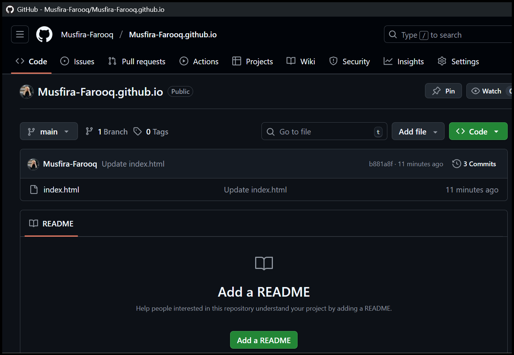

### 🔹 GitHub Pages Live Site
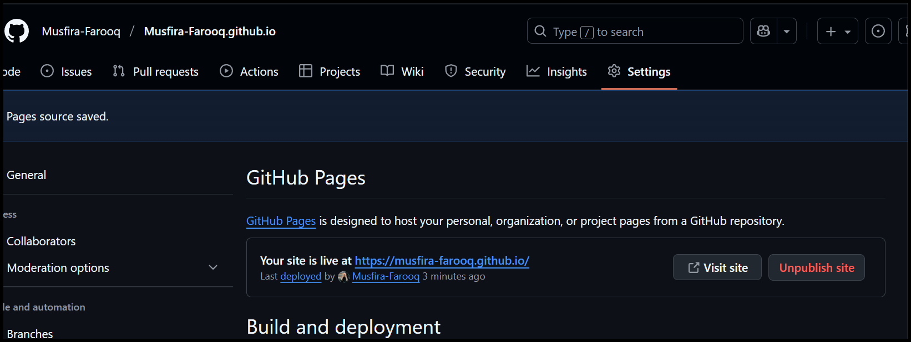

---

## 🌍 Live Website
👉 [https://musfira-farooq.github.io/](https://musfira-farooq.github.io/)

---

## ✅ Summary
This assignment demonstrates:
- Setting up **Gitea** in Codespaces  
- **Mirroring** repositories from Gitea → GitHub  
- Using **Git LFS** to manage large files  
- Publishing a **Portfolio Website** via **GitHub Pages**

---
