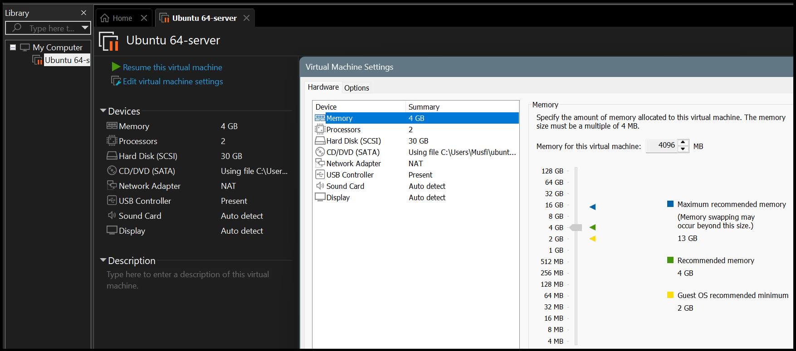
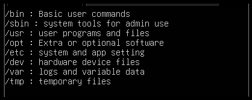
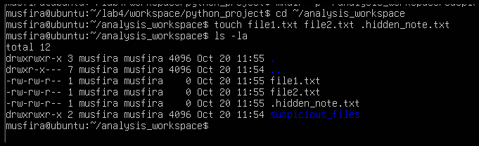
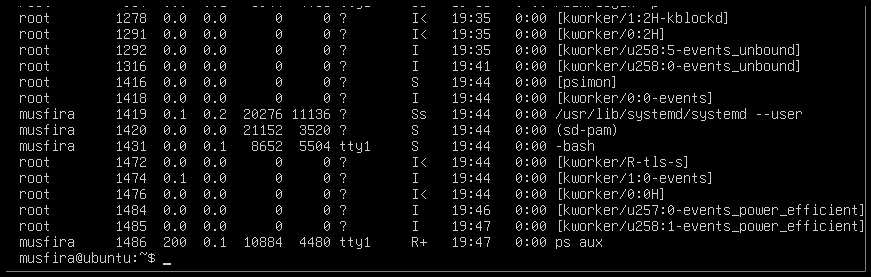
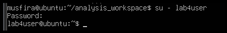
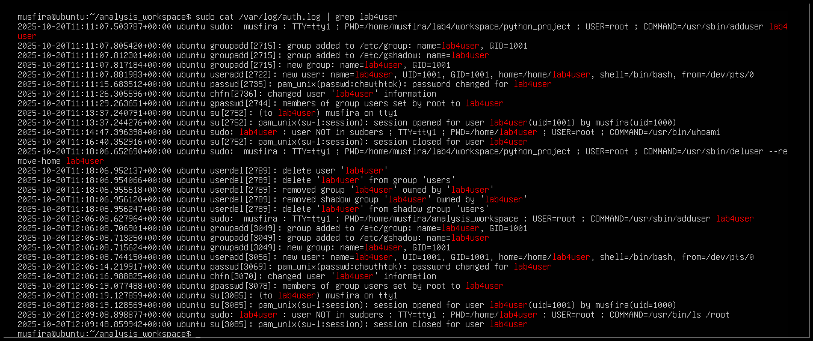
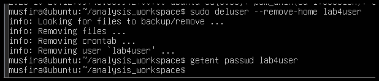

# 🌩️ Cloud Computing Lab 04  
## 🐧 Virtualization & Linux Fundamentals

**👩‍💻 Student:** Musfira Farooq  
**🎓 Roll No:** 2023-BSE-045  
**🏫 Department:** Software Engineering (BSE V-B)  
**👨‍🏫 Instructor:** Sir Muhammad Shoaib  

---

## 🔹 Task 01: VM Configuration

---

## 🔹 Task 02: SSH Connection
.png)  
.png)

---

## 🔹 Task 03: Linux Directory Structure

.png)  
.png)  
.png)  
.png)  
.png)  
.png)  
.png)  
.png)  
.png)  
.png)  
.png)

---

## 🔹 Task 04: File & Directory Operations

.png)  
.png)  
.png)  
.png)  
.png)  
.png)  
.png)  
.png)  
.png)  
.png)  
.png)  
.png)  
.png)  
.png)

---

## 🔹 Task 05: System Information

.png)  
.png)  
.png)  
.png)  
.png)

---

## 🔹 Task 06: User Management

.png)  
.png)  
.png)  
.png)  
.png)  
.png)

---

## 📝 Exam Evaluation

### Q1 – Remote Access
.png)  
.png)  
.png)

### Q2 – Filesystem Inspection
  
  

### Q3 – Evidence Handling
  

### Q4 – System Profiling
  

### Q5 – User Audit
  
  

---
