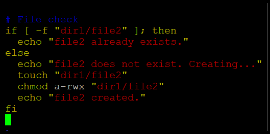

# 🌩️ Cloud Computing Lab 06  
## 🐧 Linux Users, Groups, Permissions, Pipes & Bash Scripting

**👩‍💻 Student:** Musfira Farooq  
**🎓 Roll No:** 2023-BSE-045  
**🏫 Department:** Software Engineering (BSE V-B)  
**👨‍🏫 Instructor:** Sir Muhammad Shoaib  

---

## 🔹 Task 01: Root & User Management

_set_root_password.png)  
_su_root.png)  
_exit_to_user.png)

---

## 🔹 Task 02: Add User Tom

_adduser_tom.png)  
_verify_passwd.png)  
_verify_group.png)  
_verify_shadow.png)

---

## 🔹 Task 03: Groups & Membership

_groupadd.png)  
_change_primary_group.png)  
_add_secondary_groups.png)  
_reset_secondary_groups.png)

---

## 🔹 Task 04: Users & Groups Cleanup

_add_users.png)  
_scooby_su_auth_failure.png)  
_set_password_scooby.png)  
_scooby_su_no_home.png)  
_scooby_no_home.png)  
_scooby_create_home.png)  
_scooby_login_success.png)  
_verify_users.png)  
_shell_switching.png)  
_add_groups.png)  
_verify_groups.png)  
_delete_groups.png)  
_delete_users.png)

---

## 🔹 Task 05: Ownership & File Types

_create_student.png)  
_create_files.png)  
_chown_file1.png)  
_chgrp_file1.png)  
_file_types.png)  
_exit_student.png)

---

## 🔹 Task 06: chmod – Symbolic

_su_student.png)  
_chmod_remove_rwx.png)  
_chmod_add_r.png)  
_chmod_u_plus_x.png)  
_chmod_ug_plus_w.png)  
_chmod_ugo_minus_rwx.png)

---

## 🔹 Task 07: chmod – More Practice

_student_context.png)  
_chmod_set_all_rwx.png)  
_remove_exec_go.png)  
_remove_all_perms.png)

---

## 🔹 Task 08: chmod – Numeric

_student_context.png)  
_chmod_777.png)  
_chmod_700.png)  
_chmod_744.png)  
_chmod_640.png)  
_chmod_664.png)  
_chmod_775.png)  
_chmod_750.png)

---

## 🔹 Task 09: Pipes & Redirection

_grep_less.png)  
_grep_more.png)  
_grep_head.png)  
_redirect_overwrite.png)  
_redirect_append.png)

---

## 🔹 Task 10: Bash – If/Else

_b1_run.png)  
_b1_vim.png)  
_b2_vim.png)  
_b2_run.png)  
_b3_vim.png)  
_b3_run.png)  
_b4_vim.png)  
_b4_run.png)  
  
_b5_run.png)  
_b6_vim.png)  
_b6_run.png)

---

## 🔹 Task 11: Case Statement

_b0_vim.png)  
_b0_run.png)  
_b1_vim.png)  
_b1_run.png)  
_b2_vim.png)  
_b2_run.png)  
_b3_vim.png)  
_b3_run.png)  
_b4_vim.png)  
_b4_run.png)  
_b5_vim.png)  
_b5_run.png)  
_b6_vim.png)  
_b6_run.png)  
_b7_vim.png)  
_b7_run.png)  
_b8_run.png)  
_b8_vim.png)  
_b9_vim.png)  
_b9_run.png)

---

## 🔹 Task 12: For Loop

_b1_vim.png)  
_b1_run.png)  
_b2_vim.png)  
_b2_run.png)

---

## 🔹 Task 13: While Loop & Function

_b1_vim.png)  
_b1_run.png)  
_b2_vim.png)  
_b2_run.png)  
_b3_vim.png)  
_b3_run.png)  
_b4_vim.png)  
_b4_run.png)

---

## 🔹 Task 14: Codespace + VNC Script

_fork.png)  
_codespace_launch.png)  
_start_script_ls.png)  
_start_run.png)  
_ports_view.png)  
_vnc_url.png)  
_vnc_desktop.png)  
_vnc_password_prompt.png)  
_stop_run.png)

---

## 📝 Exam Evaluation

.png)  
.png)  
.png)  

.png)  
.png)  
.png)  

.png)  
.png)  
.png)  

.png)  
.png)  
.png)  
.png)  
.png)  
.png)  

.png)  
.png)  
.png)  
.png)  

.png)  
.png)  

.png)  
.png)

---
