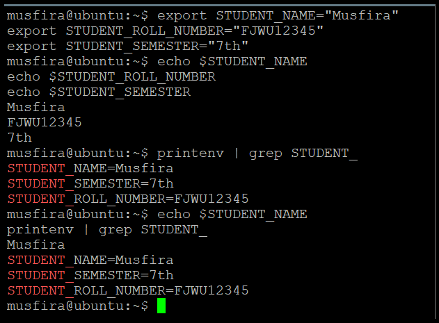

# 🌩️ Cloud Computing Lab 07  
## 🔐 Environment Variables, PATH, UFW & SSH Authentication

**👩‍💻 Student:** Musfira Farooq  
**🎓 Roll No:** 2023-BSE-045  
**🏫 Department:** Software Engineering (BSE V-B)  
**👨‍🏫 Instructor:** Sir Muhammad Shoaib  

---

## 🔹 Task 01: Environment Variables

.png)  
.png)

---

## 🔹 Task 02: Export & Persist

.png)  
.png)  
.png)  
.png)

---

## 🔹 Task 03: Bashrc Persistent

.png)  
.png)  
.png)

---

## 🔹 Task 04: PATH & Welcome Script

.png)  
.png)  
.png)  
.png)  
.png)  
.png)  
.png)  
.png)  
.png)

---

## 🔹 Task 05: UFW Firewall

.png)  
.png)  
.png)  
.png)  
.png)

---

## 🔹 Task 06: SSH Key Authentication

.png)  
.png)  
.png)  
.png)  
.png)  
.png)  
.png)  
.png)  
.png)

---

## 📝 Exam Evaluation

.png)  
.png)  

  

.png)  
.png)  

.png)  
.png)  

.png)  
.png)  
.png)

---
