# 🌩️ Cloud Computing Lab 09  
## 🧩 Codespaces + AWS CLI, EC2, IAM, Security Groups & Queries

**👩‍💻 Student:** Musfira Farooq  
**🎓 Roll No:** 2023-BSE-045  
**🏫 Department:** Software Engineering (BSE V-B)  
**👨‍🏫 Instructor:** Sir Muhammad Shoaib  

---

## 🔹 Task 01: GitHub CLI & Codespaces Setup

  
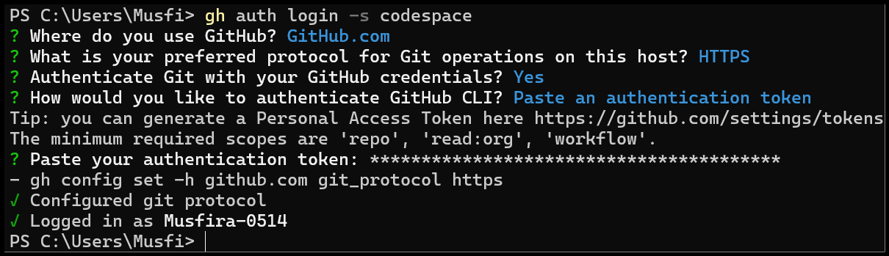  
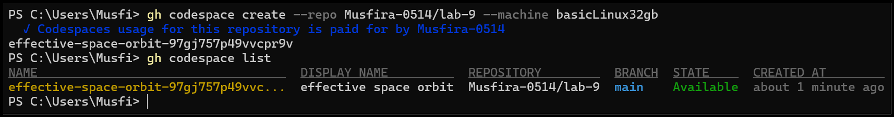  

---

## 🔹 Task 02: AWS CLI Installation & Configuration

.png)  
.png)  
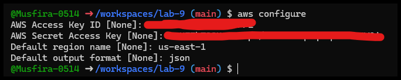  
.png)  

---

## 🔹 Task 03: Security Group Creation & Ingress Rules

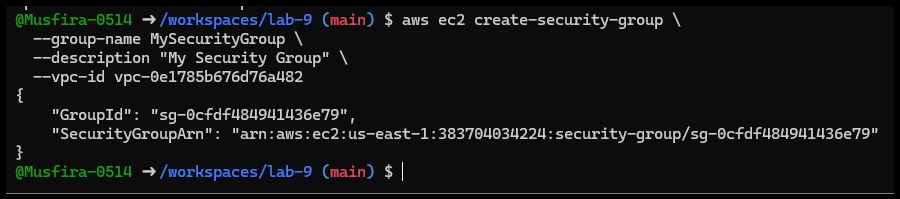  
  
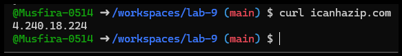  
  
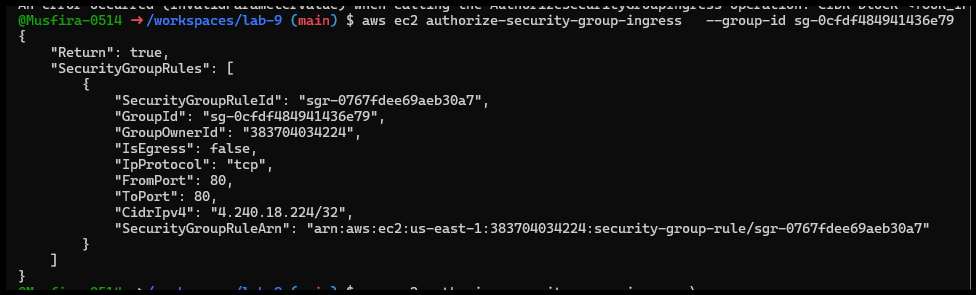  
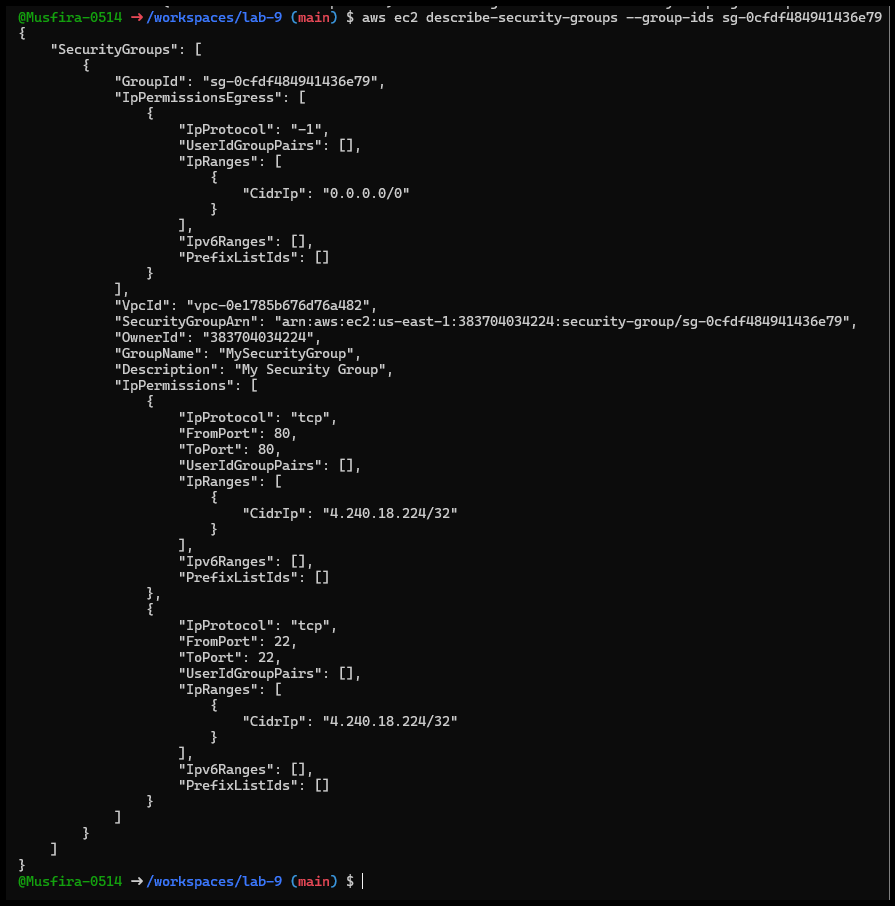

---

## 🔹 Task 04: Key Pair, EC2 Launch & SSH

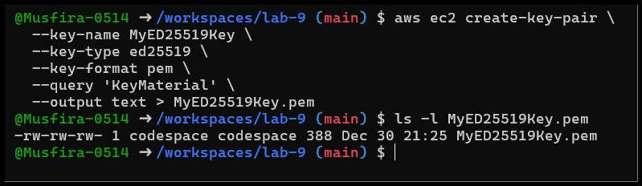  
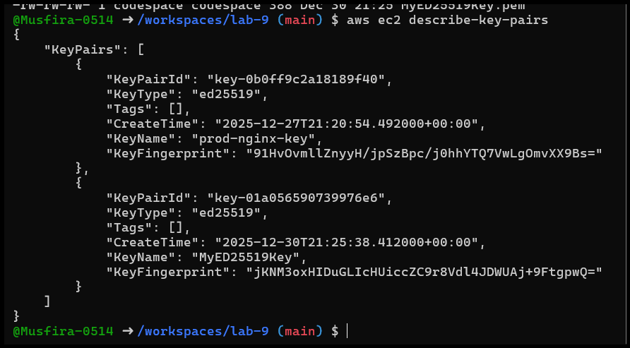  
  
  
  
  
  
.png)

---

## 🔹 Task 05: AWS Describe Commands

  
  
  
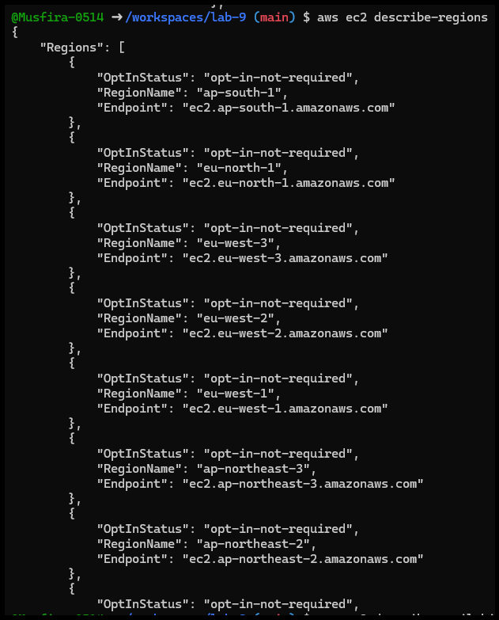  

---

## 🔹 Task 06: IAM Groups, Users & Access Keys

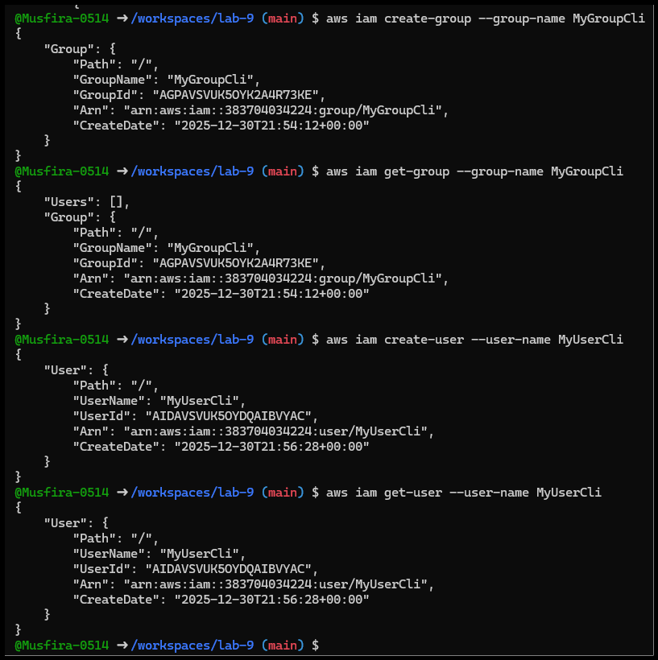  
.png)  
.png)  
.png)  
.png)  
  
.png)  
.png)  
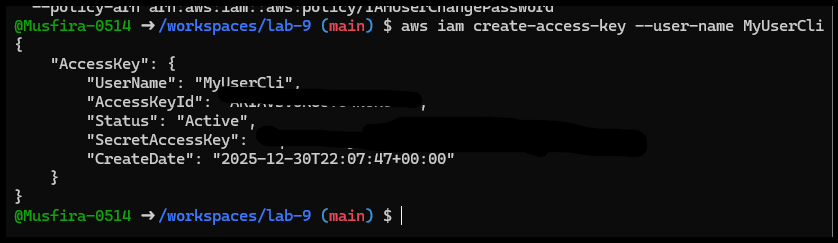  
.png)  
  
.png)  
.png)  

---

## 🔹 Task 07: Filters (describe-instances)

  
  
  
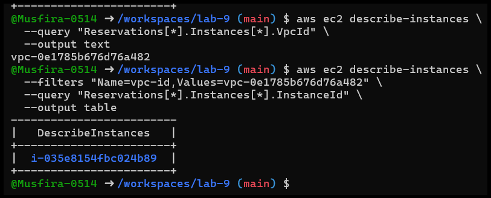

---

## 🔹 Task 08: Query Output Formatting

  
  

---

## 🧹 Cleanup – AWS Resource Removal

  
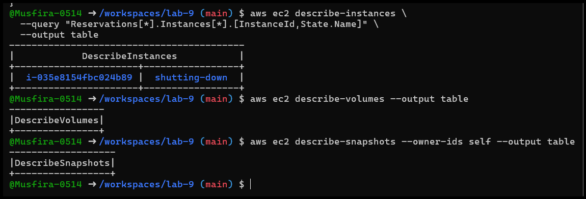  
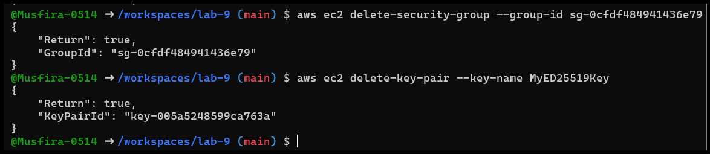  
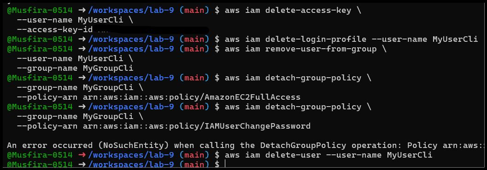  

---
