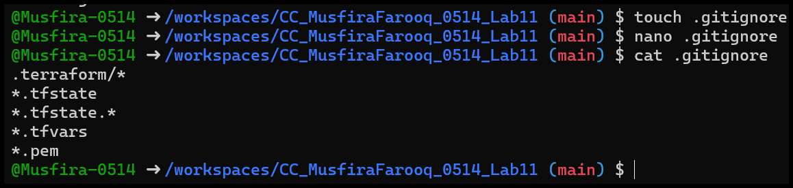

# 🧪 Lab 11 – GH CLI Codespaces + AWS + Terraform

## Variables, Collections, Sensitivity & EC2 Provisioning

**Name:** MUSFIRA FAROOQ

**Roll Number:** 2023-BSE-045

**Instructor:** SIR MUHAMMAD SHOAIB

---

## Task 0 — Lab Setup (Codespace & GH CLI)

**Objective:** Create and connect to a GitHub Codespace using GH CLI.

1. Codespace creation and listing
   .png)

2. Codespace SSH connection
   .png)

---

## Task 1 — Provider & Basic Variable (Variable Precedence)

**Objective:** Configure AWS provider and demonstrate Terraform variable precedence.

1. Create `main.tf`
   .png)

2. AWS provider block added
   .png)

3. Terraform initialization
   .png)

4. Variable and output blocks added
   .png)

5. Apply prompting for variable input
   .png)

6. Apply using default value
   .png)

7. Apply using environment variable (`TF_VAR`)
   .png)

8. Apply using `terraform.tfvars`
   .png)

9. Apply using `-var` override
   .png)

10. Environment variable before & after unset
    .png)

---

## Task 2 — Variable Validation & Sensitive / Ephemeral Variables

**Objective:** Implement variable validation and handle sensitive and ephemeral values.

1. Subnet CIDR variable with validation
   .png)

2. Validation error for invalid CIDR
   .png)

3. Sensitive API token variable added
   .png)

4. Apply masking sensitive output
   .png)

5. Terraform state showing sensitive value
   .png)

6. Ephemeral variable behavior/error
   .png)

7. Apply using default sensitive value
   .png)

---

## Task 3 — Project-level Variables, Locals & Outputs

**Objective:** Use project-level variables, locals, and outputs.

1. Project variables added
   .png)

2. `terraform.tfvars` populated
   .png)

3. `locals.tf` created
   .png)

4. Terraform apply showing outputs
   .png)

---

## Task 4 — Maps and Objects

**Objective:** Work with maps and object variables in Terraform.

1. Tags map variable added
   .png)

2. Tags output displayed
   .png)

3. Server configuration object output
   .png)

---

## Task 5 — Collections: Lists, Tuples & Sets

**Objective:** Define and mutate Terraform collections.

1. Collection variables defined
   .png)

2. Terraform apply comparing collections
   .png)

3. Locals with mutated collections
   .png)

4. Output comparison of mutations
   .png)

---

## Task 6 — Null, Any Type & Dynamic Values

**Objective:** Handle optional, dynamic, and null values.

1. Optional tag variable added
   .png)

2. Locals merge logic
   .png)

3. Apply with no optional tag
   .png)

4. Apply with optional tag set
   .png)

5. Dynamic value as string
   .png)

6. Dynamic value as number
   .png)

7. Dynamic value as list
   .png)

8. Dynamic value as map
   .png)

9. Dynamic value as null
   .png)

---

## Task 7 — Git Ignore

**Objective:** Prevent sensitive files from being committed.

1. `.gitignore` created
   

---

## Task 8 — Build Real Infrastructure (VPC & Networking)

**Objective:** Provision VPC, subnet, IGW, and routing.

1. Clean Terraform files
   .png)

2. Variables recreated
   .png)

3. VPC resource added
   .png)

4. Subnet resource added
   .png)

5. `terraform.tfvars` updated
   .png)

6. Apply showing VPC & subnet
   .png)

7. IGW & route table before apply
   .png)

8. IGW & route table after apply
   .png)

9. Default route table created
   .png)

10. Default route table applied
    .png)

---

## Task 9 — Security Group, EC2 & Nginx

**Objective:** Provision EC2 instance and configure Nginx.

1. `my_ip` variable added
   .png)

2. Public IP retrieved
   .png)

3. Security group applied
   .png)
   
   .png)

5. Key pair created and saved
   .png)
   
   .png)

7. EC2 instance created
   .png)
   
   .png)

9. SSH into EC2
   .png)
   
   .png)
   
   .png)
   
   .png)

11. Nginx installation & verification
   .png)

   .png)
   
   .png)

---

## Cleanup — Destroy Resources

1. Terraform destroy
   .png)

2. State files after cleanup
   .png)

3. Final verification (no secrets committed)
   .png)
