# 🌩️ Cloud Computing Lab 15 (Project)  
## 🚀 Terraform + Ansible Roles: High Availability Web Architecture

**👩‍💻 Student:** Musfira Farooq  
**🎓 Roll No:** 2023-BSE-045  
**🏫 Department:** Software Engineering (BSE V-B)  
**👨‍🏫 Instructor:** Sir Muhammad Shoaib  

---

## 📌 Project Overview

This lab project demonstrates a **fully automated High Availability (HA) web architecture** on AWS using:

- **Terraform** for infrastructure provisioning  
- **Ansible Roles** for configuration management  

### Architecture:
- **1 Frontend EC2** → Nginx (Reverse Proxy / Load Balancer)  
- **3 Backend EC2s** → Apache HTTPD  
  - 2 Primary backends  
  - 1 Backup backend  

---

## 🔹 Task 01: Repository & Project Initialization

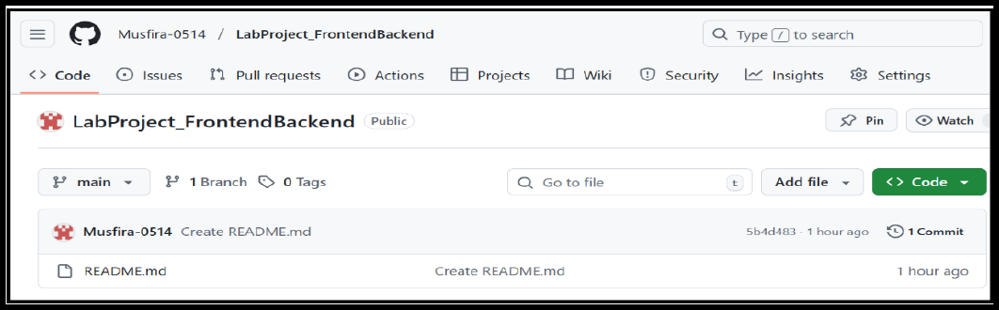  
  
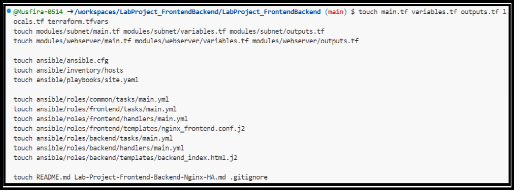

---

## 🔹 Task 02: Project Structure Setup

  
  

---

## 🔹 Task 03: Installing Required Tools

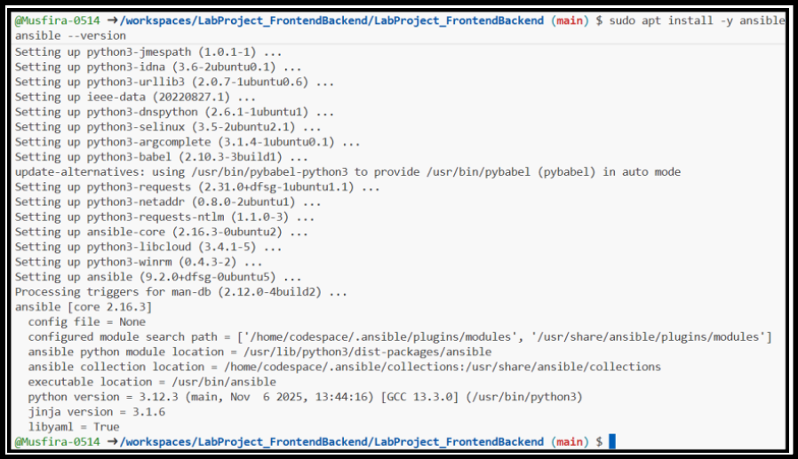  
  
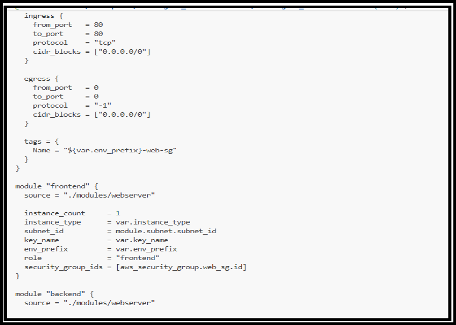

---

## 🔹 Task 04: Terraform Root Configuration

  
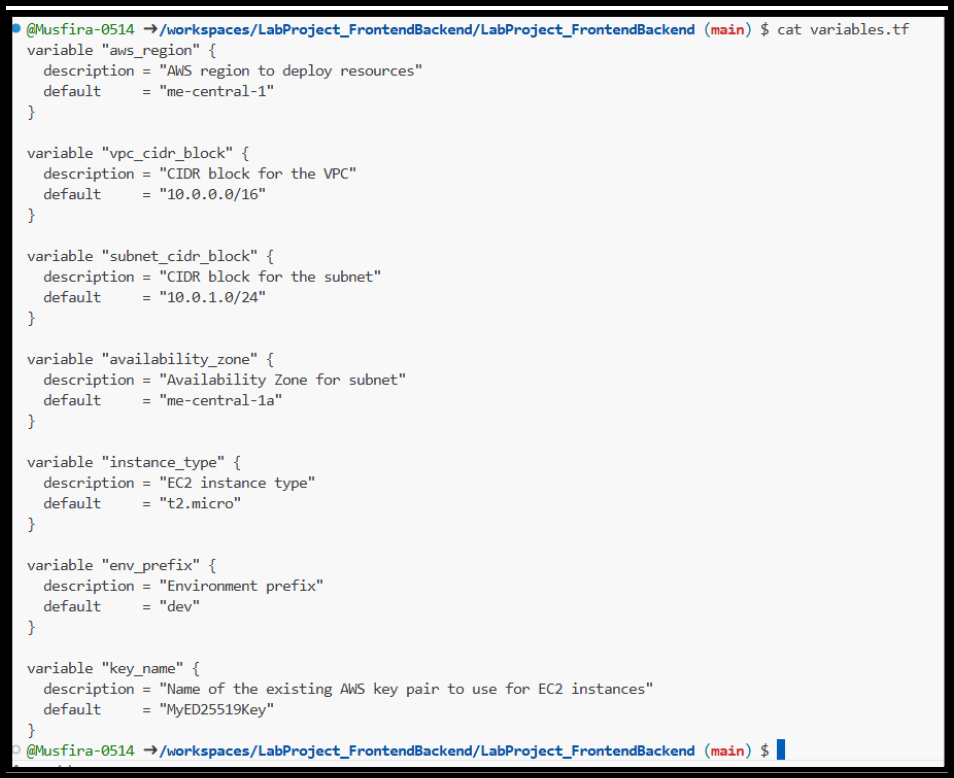  
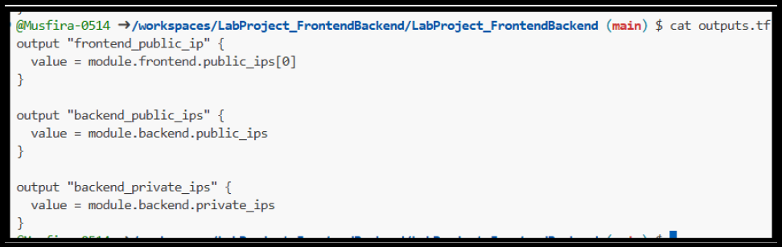  
  
  

---

## 🔹 Task 05: Network Module (VPC & Subnet)

  
  
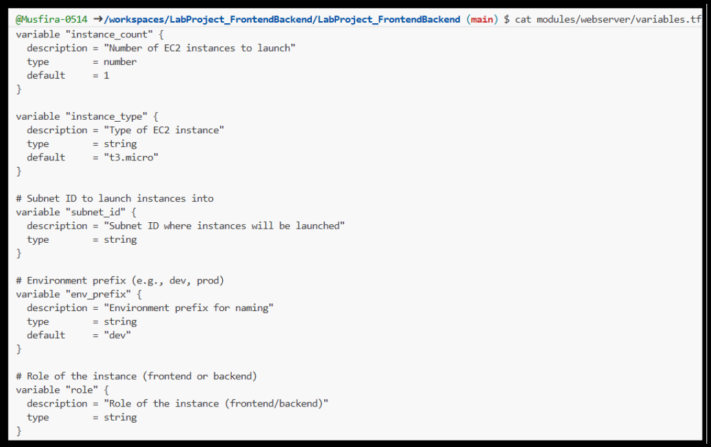

---

## 🔹 Task 06: Webserver Module (EC2 Instances)

  
  

---

## 🔹 Task 07: Ansible Configuration

  
  
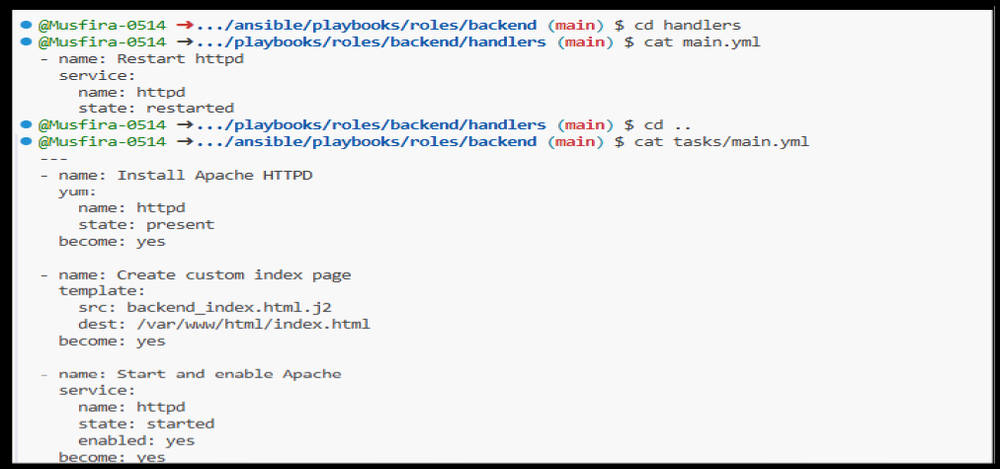

---

## 🔹 Task 08: Backend Role Implementation

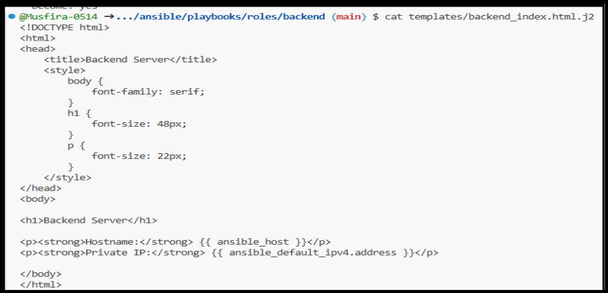  
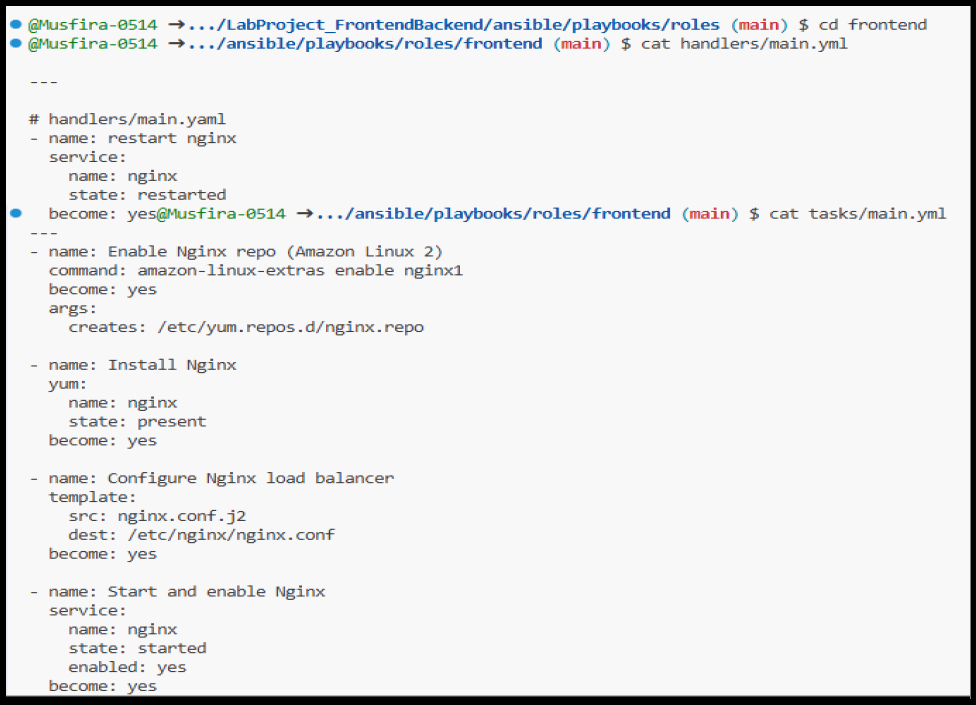  
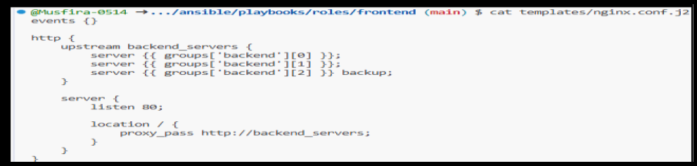

---

## 🔹 Task 09: Frontend Role Implementation

  
  
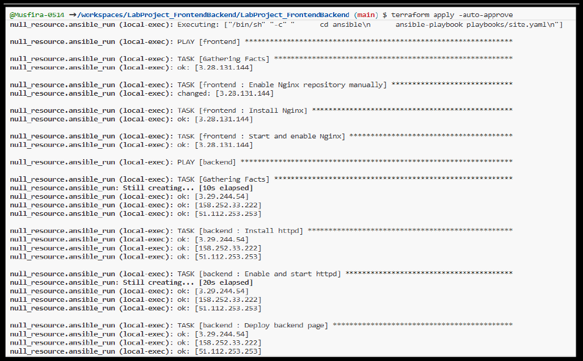

---

## 🔹 Task 10: SSH Key Generation

---

## 🔹 Task 11: Terraform Execution

  
  
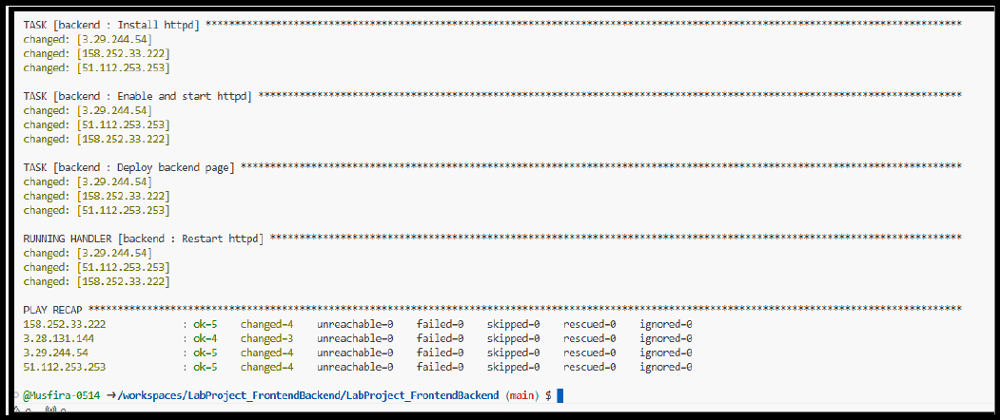

---

## 🔹 Task 12: Ansible Automation via Terraform

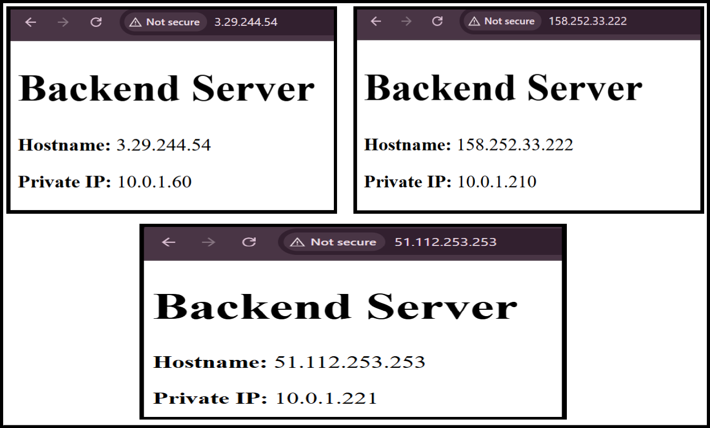

---

## 🔹 Task 13: Verification & Testing

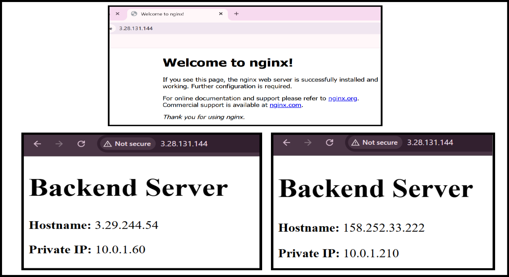

---

## 🌐 Verification Results

### Backend URLs
Each backend displays a **unique page**:
- Backend 1  
- Backend 2  
- Backend 3 (Backup)

### Frontend URL
- Requests are load-balanced between **Backend 1 & 2**
- When both are down, traffic is served by **Backend 3**

---

## 🧹 Cleanup

- All EC2 instances terminated  
- Security groups removed  
- Terraform state cleaned  

---

## ✅ Conclusion

This project successfully demonstrates:
- Infrastructure as Code (IaC) using Terraform  
- Configuration management using Ansible roles  
- High availability with load balancing and failover  
- Fully automated, repeatable deployment  

---

## 🔗 Repository Links

- https://github.com/Musfira-0514/LabProject_FrontendBackend
