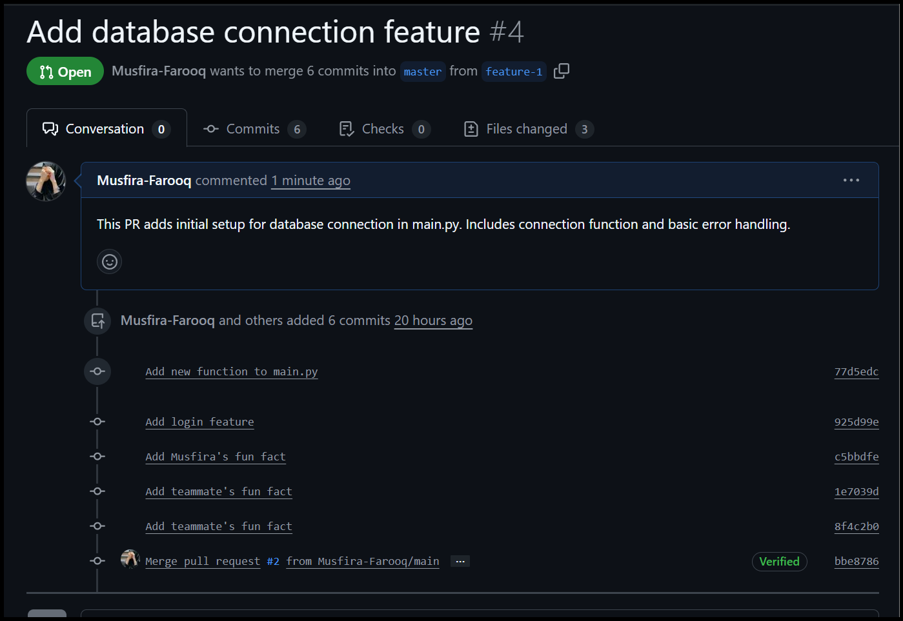
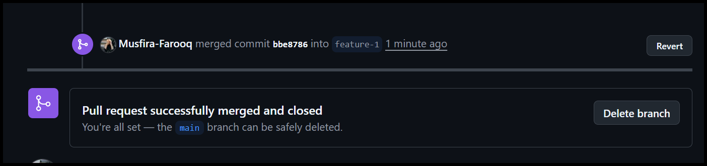
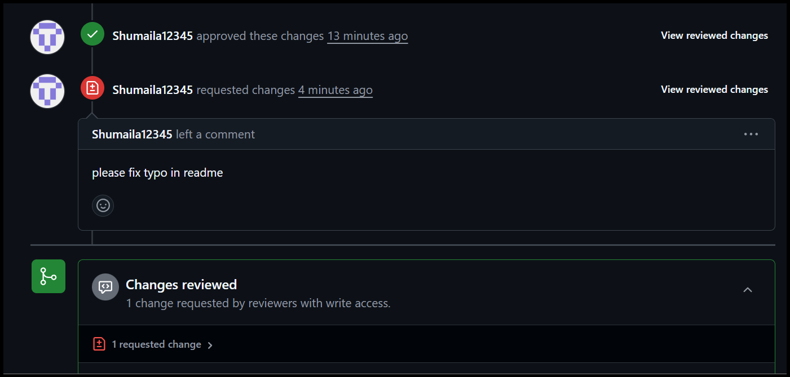
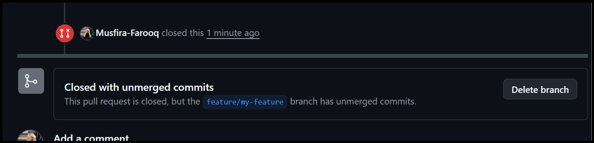
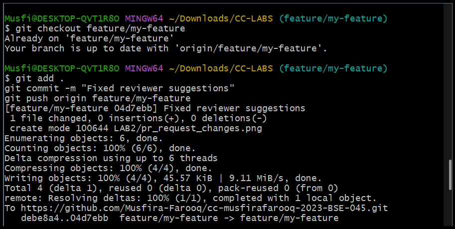
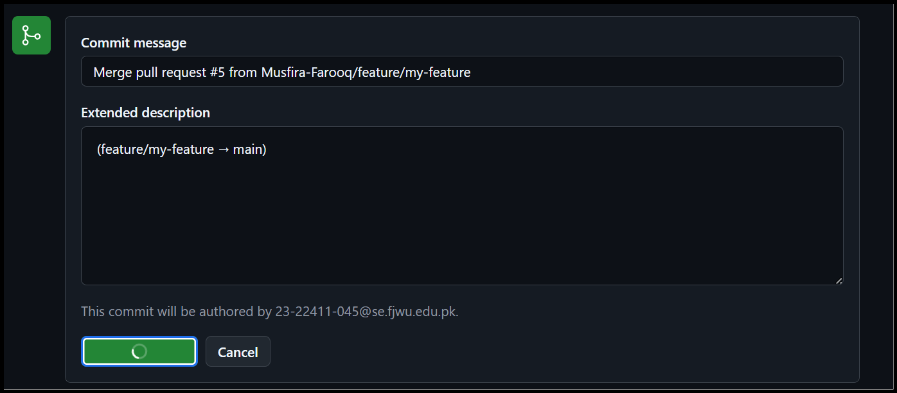
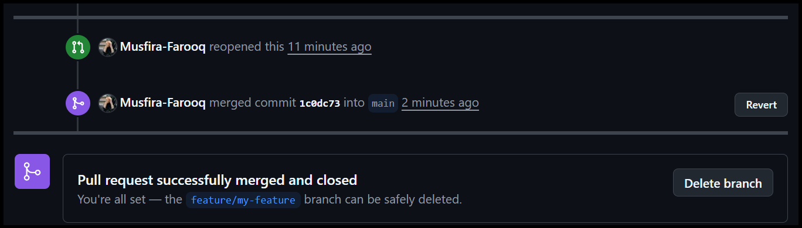
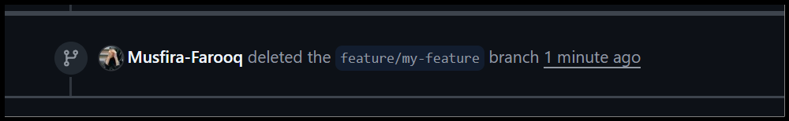
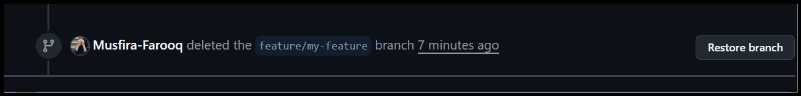
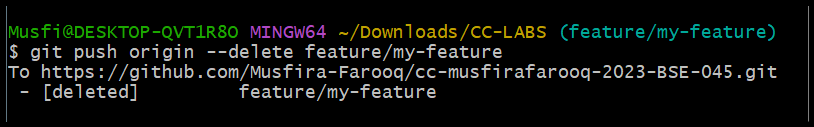

# 🌩️ Cloud Computing: Hands-On Git & Version Control (LAB 02)

**👩‍💻 Student:** *Musfira Farooq*  
**🎓 Roll No:** *2023-BSE-045*  
**🏫 Department:** *Software Engineering (BSE V-B)*  

---

## 🧾 Task 01: Create Private GitHub Repository

---

## 🔐 Task 02: Connect Repository via SSH

---

## 👩‍💻 Task 03: Configure Git Username and Email

---

## 🗂️ Task 04: Explore the `.git` Folder

---

## 🧱 Task 05: Local Repository Management

---

## 📄 Task 06: File Status & Staging

---

## 🌿 Task 07 & 08: Branch Creation (GUI & Bash)

---

## ⚙️ Task 09: Branching & Merging (Local Feature Development)

---

## 🔄 Task 10: Pull Request and Branch Review (GitHub GUI)

---

## 🧩 Task 11: Detailed Branch Strategy (Develop/Staging Simulation)

---

## 🧑‍💼 Task 12: Code Review Workflow

  

### 🔹 Reviewer Actions
- Reviewer approved PR →   
- Requested changes →   
- Optional rejection simulated →   
- Updated with new commits → 

### 🔹 Merge & Post-Merge Actions
- PR merged via GUI →   
  
- Feature branch deleted → 

---

## 🧹 Task 13: Branch Cleanup Best Practices
  

---

## 👭 Bonus Task: Simulated Team Collaboration

---

## 🧾 Exam Evaluation Questions

### ✅ Q1 – Advanced Branching & Merge Verification

### ✅ Q2 – Multi-Stage Workflow Simulation

### ✅ Q3 – Collaboration & Conflict Resolution

---

### 🏷️ End of File
