# ☁️ Cloud Computing – Lab 03  
### Working with Git History, Stashing, and Reverting Commits

---

### 🏫 Course
BSE (V-B)

### 👩‍🎓 Submitted By
**Name:** Musfira Farooq  
**Roll No:** 2023-BSE-045  

### 👨‍🏫 Submitted To
**Instructor:** Sir Muhammad Shoaib  

---

## 🧪 Task 1: Handling Local and Remote Commit Conflicts (Pull vs Pull --rebase)

**Remote change committed on GitHub**  
.png)

**Local change committed on your machine**  
.png)

**Push rejected due to remote changes**  
.png)

**Merge commit after `git pull --no-rebase`**  
.png)

**Push successful after merge**  
.png)

**Local commits rebased on top of remote changes (`git pull --rebase`)**  
.png)

**Push successful after rebase**  
.png)

---

## 🧩 Task 2: Creating and Resolving Merge Conflicts Manually

**Remote conflicting change committed on GitHub**  
.png)

**Local conflicting change edited in VS Code**  
.png)

**Local conflicting change committed**  
.png)

**Push rejected due to conflict**  
.png)

**Conflict message shown during rebase**  
.png)

**File after manual conflict resolution**  
.png)

**Rebase continued after resolving conflict**  
.png)

**Push successful after resolving conflict**  
.png)

---

## 📁 Task 3: Managing Ignored Files with .gitignore and Removing Tracked Files

**Textfiles directory added and pushed to GitHub**  
.png)

**`.gitignore` added and pushed to ignore textfiles**  
.png)

**Textfiles still visible on GitHub after adding `.gitignore`**  
.png)

**Tracked textfiles removed from Git cache and pushed**  
.png)

**Textfiles folder removed from GitHub remotely**  
.png)

---

## 🧰 Task 4: Create Temporary Changes and Use `git stash`

**Changes made and committed on feature branch**  
.png)

**Error shown when trying to switch branch with uncommitted changes**  
.png)

**Changes stashed using `git stash`**  
.png)

**Branch switch successful after stashing**  
.png)

**Returned to feature branch**  
.png)

**Working directory clean after switching back**  
.png)

**Stashed changes restored with `git stash pop`**  
.png)

---

## 🧾 Task 5: Checkout a Specific Commit Using `git log`

**Commit history viewed with `git log --oneline`**  
.png)

**Checked out a specific commit (detached HEAD)**  
.png)

**Returned to main branch**  
.png)

---

## 🔄 Task 6: Resetting Commits (Soft vs Hard Reset)

**First change committed**  
.png)

**Second change committed**  
.png)

**Commit history viewed before reset**  
.png)

**File verified with both changes**  
.png)

**Soft reset performed (changes kept staged)**  
.png)

**Commit history after soft reset**  
.png)

**File verified after soft reset**  
.png)

**Re-commit performed**  
.png)

**Hard reset performed (changes discarded)**  
.png)

**Commit history after hard reset**  
.png)

**File verified after hard reset**  
.png)

---

## ✏️ Task 7: Amending the Last Commit

**Initial change committed**  
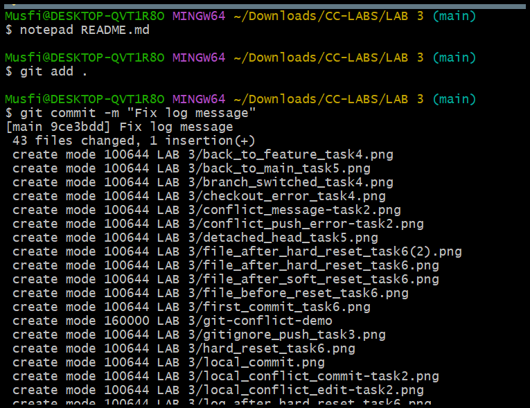

**Forgot changes added and last commit amended**  
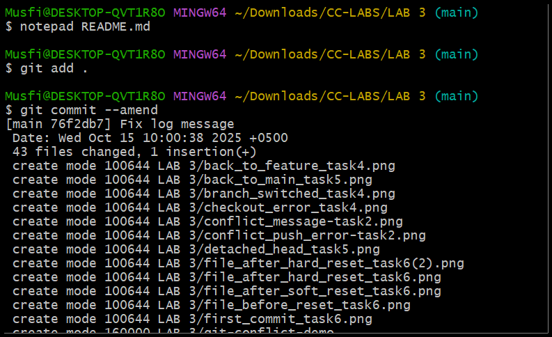

---

## 🔁 Task 8: Reverting a Commit (Safe Undo on Remote Branch)

**Temporary change committed and pushed**  
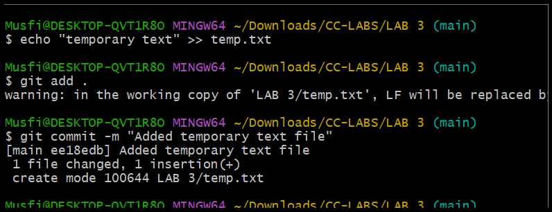

**Commit reverted safely**  
.png)

**Revert commit pushed to remote**  
.png)

---

## ⚠️ Task 9: Force Push (With Caution)

**New branch created for testing force push**  
.png)

**Small change committed on the branch**  
.png)

**Change pushed normally to remote**  
.png)

**Hard reset performed locally**  
.png)

**Push rejected due to remote being ahead**  
.png)

**Force push used to update remote branch**  
.png)

---

## 🐳 Task 10: Running Gitea in GitHub Codespaces via Docker Compose

**Gitea repository forked to own GitHub account**  
.png)

**Codespace created and loaded for the forked repository**  
.png)

**Gitea started using Docker Compose in Codespaces**  
.png)

**Gitea installation page opened in browser**  
.png)

**Admin account configured during setup**  
.png)

**Gitea dashboard loaded successfully after login**  
.png)

**New repository created inside Gitea**  
.png)

---

## 🌐 Task 11: Creating a GitHub Pages Portfolio Site

**GitHub Pages repository created with `username.github.io`**  
.png)

**Static website code prepared locally**  
.png)

**Files added, committed, and pushed to GitHub**  
.png)  
.png)

**GitHub Pages settings checked and site published**  
.png)

**Live site visited and verified**  
.png)  
.png)

🔗 **Live URL:** [https://musfira-farooq.github.io/](https://musfira-farooq.github.io/)

---

## 🧮 Exam Evaluation Questions

### Q1: Local vs Remote Conflict Resolution
**Remote edit committed**  
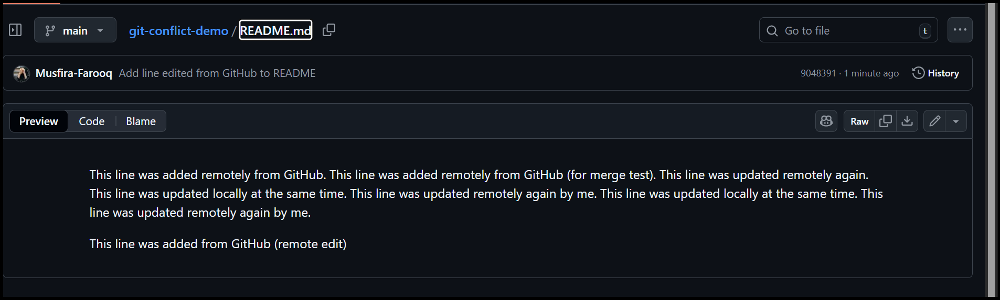

**Local edit committed**  
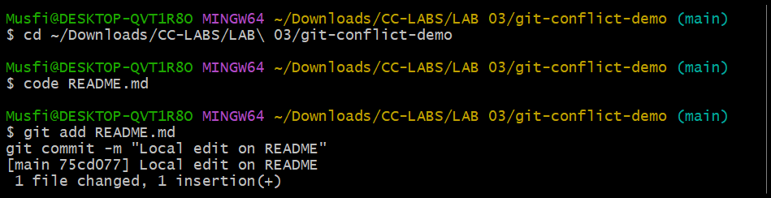

**Push error observed**  
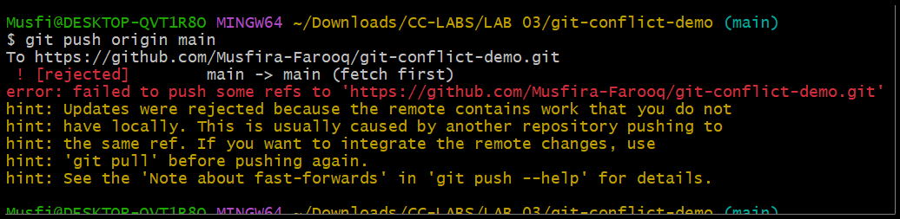

**Conflict resolved via merge and pushed**  
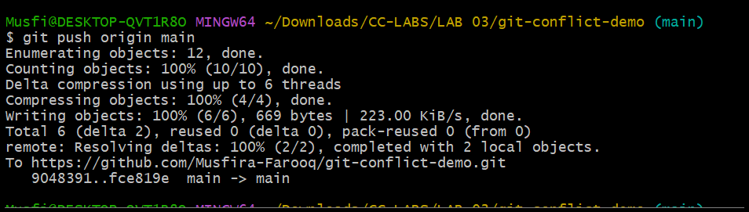

**Conflict resolved via rebase and pushed**  
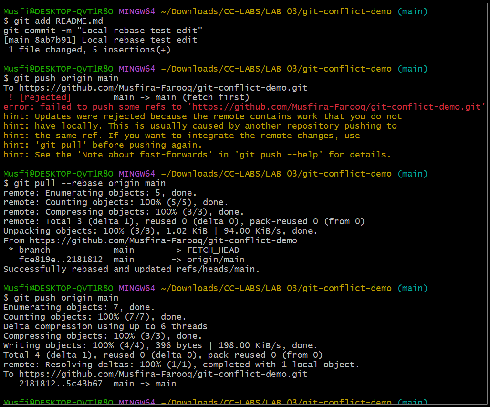

---

### Q2: Manual Merge Conflict Handling
**Remote conflicting edit**  
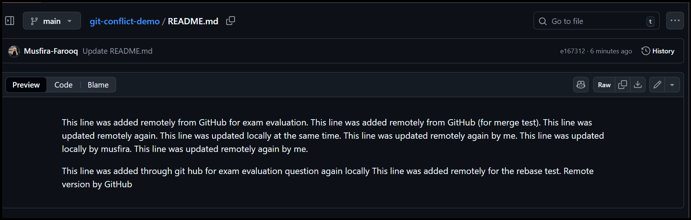

**Local conflicting edit**  
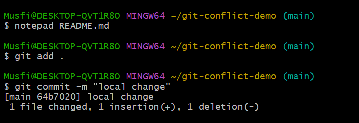

**Push rejected due to conflict**  
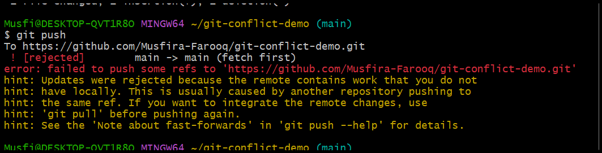

**Conflict triggered via rebase**  
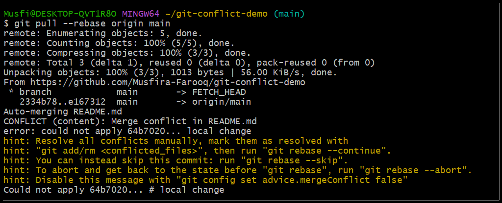

**File manually resolved**  
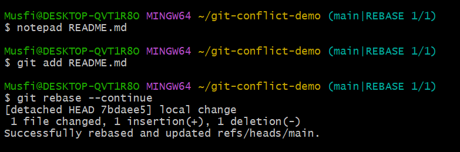

**Rebase continued and changes pushed**  
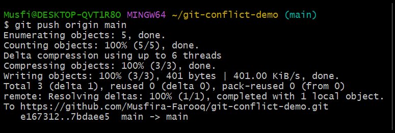

---

### Q3: Managing Ignored and Tracked Files
**Folder created locally**  
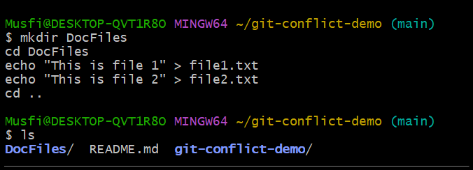

**Files committed and pushed**  
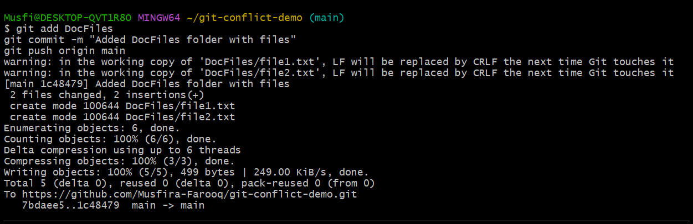

**Folder added to `.gitignore`**  
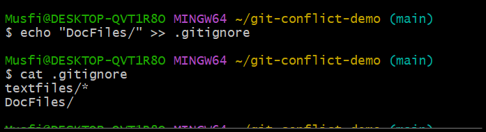

**`.gitignore` changes committed and pushed**  
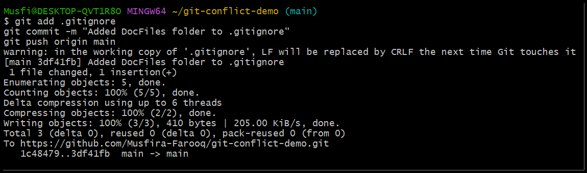

**Folder untracked from Git**  
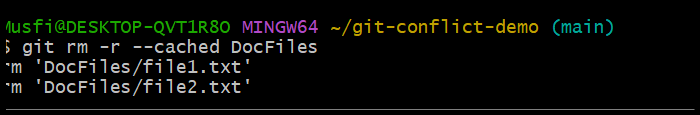

**Folder removed from GitHub**  
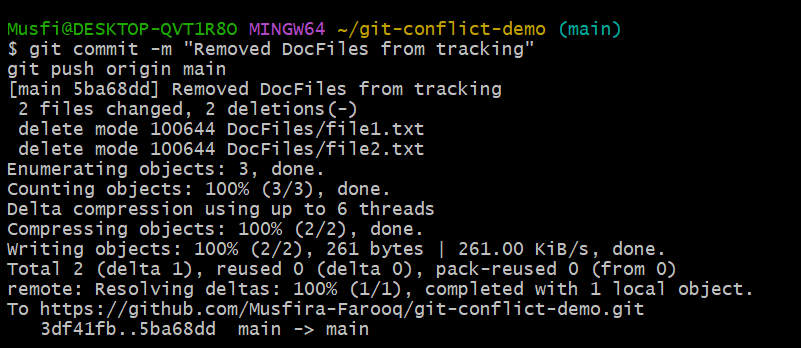  
.png)

---

### Q4: Commit History Manipulation and Recovery
**First commit made**  
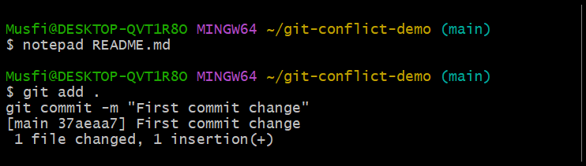

**Second commit made**  
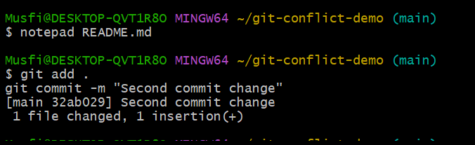

**Commit history viewed**  
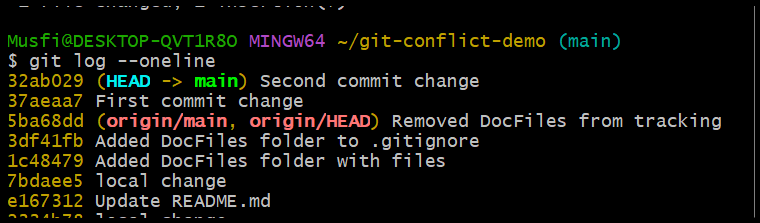

**Soft reset performed**  
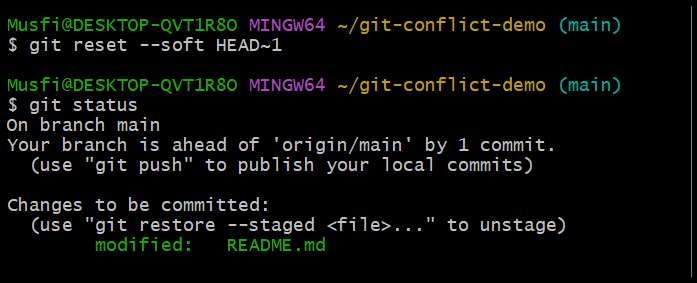

**Third commit made again**  
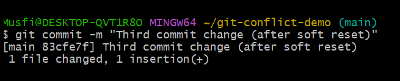

**Hard reset performed**  
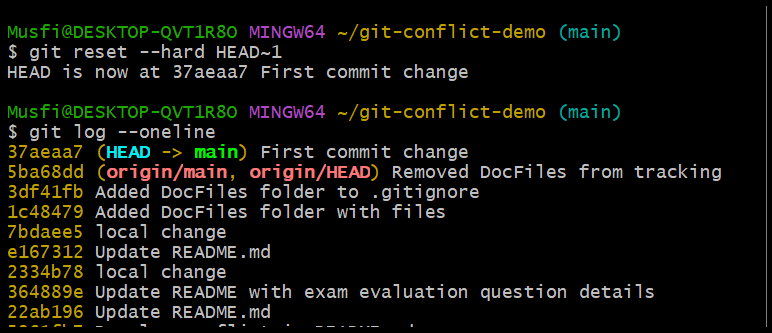

---

📂 **GitHub Repository:** [https://github.com/Musfira-Farooq/git-conflict-demo.git](https://github.com/Musfira-Farooq/git-conflict-demo.git)
