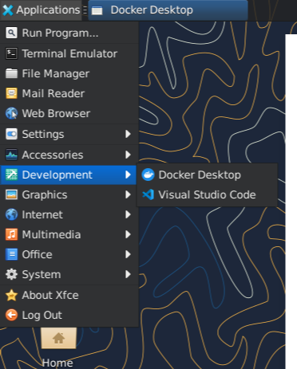

CLOUD COMPUTING
## LAB 05 – Installing, Managing Packages, GUI, and Tools in Ubuntu  

**Submitted By:**  
Musfira Farooq  

**Roll No:**  
2023-BSE-045  

**Section:**  
BSE (V-B)

**Submitted To:**  
Sir Muhammad Shoaib  

---

## Task 1 – Java

### Java Suggestion Message
_java_suggestion.png)

### Installing Java using apt
_java_install.png)

### Checking Java Version
_java_version.png)

### Removing Java Package
_java_remove.png)

### Java Not Found After Removal
_java_not_found.png)

### Clearing Shell Cache (hash -r)
_hash_clear.png)

---

## Task 2 – Java with apt-get

### Installing Java using apt-get
_aptget_install.png)

### Verifying Java Version
_java_version_after_aptget.png)

### Removing Java using apt-get
_aptget_remove.png)

### Verifying Java Removed
_hash_after_remove.png)

---

## Task 3 – Update & Upgrade

### Running apt update
_apt_update.png)

### Running apt upgrade
_apt_upgrade.png)

### Written Explanation File
_explanation.png)

---

## Task 4 – VS Code using Snap

### Installing VS Code
_snap_install.png)

### Listing Installed Snap Packages
_snap_list.png)

### Checking VS Code Version
_code_version_or_info.png)

### Snap Binary Location
_snap_bin_location.png)

---

## Task 5 – RDP & GUI (XFCE)

### Updating Packages
_update.png)

### Installing XFCE4
_xfce_install.png)

### Enabling XRDP Service
_xrdp_enable.png)

### Checking XRDP Status
_xrdp_status.png)

### Configuring .xsession
_xsession.png)

### Remote Desktop Connection Established
_rdp_connected.png)

### Launching VS Code in GUI
_vscode_launch.png)

---

## Task 6 – LightDM + GUI

### Installing LightDM and Greeter
_lightdm_install.png)

### Configuring LightDM for XFCE
_lightdm_config.png)

### Cleaning Session Files
_lightdm_cleanup.png)

### Restarting LightDM Service
_lightdm_restart.png)

### Enabling GUI on Boot
_gui_enable_boot.png)

### GUI Login After Reboot
_after_reboot_gui.png)

### Disabling GUI on Boot
_gui_disable_boot.png)

### CLI Mode After Reboot
_after_reboot_cli.png)

### Starting GUI Manually
_gui_start.png)
_gui_start.png)

### Stopping GUI Manually
_gui_stop.png)

### GUI Start Command Displayed
_gui_start_command.png)

### Launching VS Code from GUI
_vscode_launch.png)

---

## Task 7 – Chrome Installation

### Chrome Install Error
_install_chrome_error.png)

### Listing apt Directory
_ls_etc_apt.png)

### Viewing sources.list File
_cat_sources_list.png)

### Viewing sources.list.d Directory
_ls_sources_list_d.png)

### Editing ubuntu.sources
_edit_ubuntu_sources.png)

### Adding Google Signing Key
_add_key.png)

### Updating Packages
_apt_update.png)

### Installing Google Chrome
_install_chrome.png)

### Removing Chrome Package
_remove_key.png)

### Editing File to Remove Chrome Stanza
_create_google_chrome_list.png)

### Verifying sources.list.d Directory
_list_sources_after_create.png)

### Final Chrome Installation Success
_apt_update_alt.png)
_install_chrome_alt.png)

---

## Task 8 – Audacity + OBS

### Adding Audacity PPA
_add_ppa_audacity.png)

### Updating Repositories for Audacity
_apt_update_audacity.png)

### Installing Audacity
_install_audacity.png)

### Audacity Version
_audacity_version.png)

### Adding OBS PPA
_add_ppa_obs.png)

### Updating Repositories for OBS
_apt_update_obs.png)
_apt_update_obs.png)

### Installing OBS Studio
_install_obs.png)

### OBS Version
_obs_version.png)

---

## Task 9 – Vim YAML Editing

### Checking Vim Installation
_vim_check.png)

### Creating Directory
_mkdir_cd.png)

### Editing YAML in Vim
_vim_edit.png)

### Saving YAML File
_k8s_saved.png)

---

## Task 10 – Temporary Changes in Vim

### YAML File After Adding Annotation
_verify_annotation.png)

### Temporary Edit (Before Discarding)
_verify_entering_temp_data.png)

### File After Discarding Temporary Changes
_verify_no_temp_comment.png)

---

## Task 11 – Vim Deleting & Navigation

### Delete Line + Undo
_dd_delete_and_undo.png)

### Delete 3 Lines + Undo
_delete3_and_undo.png)

### Navigation to Line 1
_line1.png)

### Navigation Between Line Ends
_navigation.png)

---

## Task 12 – Vim Search & Replace

### Searching for “nginx”
_search_nginx.png)

### Navigation Matches with n / N
_n_and_N_navigation.png)

### Adding Extra nginx Occurrences
_added_occurrences.png)

### Cycle Matches
_cycle_matches.png)

### Substitute nginx → webapp
_substitute_result.png)

### Undo Substitution
_undo_and_quit.png)

---

## Exam Evaluation – Docker Desktop Installed

.png)

