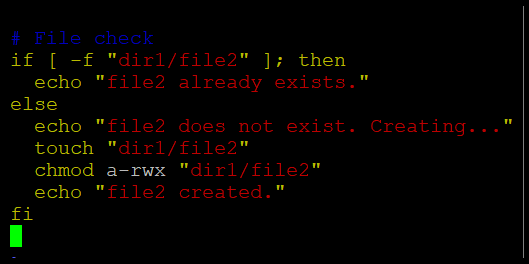

# ☁️ Cloud Computing — Lab 06  
### **Linux Users, Groups, Permissions, Pipes, and Bash Scripting**

**Submitted By:** Musfira Farooq  
**Roll No:** 2023-BSE-045  
**Submitted To:** Sir Muhammad Shoaib  
**Class:** BSE (V-B)

---

## 🧩 Task 1 – Create Users (Jerry, Scooby)

### set_root_password  
_set_root_password.png)

### su_root  
_su_root.png)

### exit_to_user  
_exit_to_user.png)

---

## 🧩 Task 2 – Create Groups (Cartoon, Animal)

### adduser_tom  
_adduser_tom.png)

### verify_passwd  
_verify_passwd.png)

### verify_group  
_verify_group.png)

### verify_shadow  
_verify_shadow.png)

---

## 🧩 Task 3 – Add Users to Groups

### groupadd  
_groupadd.png)

### change_primary_group  
_change_primary_group.png)

### add_secondary_groups  
_add_secondary_groups.png)

### reset_secondary_groups  
_reset_secondary_groups.png)

---

## 🧩 Task 4 – Delete Users and Groups

### add_users  
_add_users.png)

### scooby_su_auth_failure  
_scooby_su_auth_failure.png)

### set_password_scooby  
_set_password_scooby.png)

### scooby_su_no_home  
_scooby_su_no_home.png)

### scooby_no_home  
_scooby_no_home.png)

### scooby_login_success  
_scooby_login_success.png)

### verify_users  
_verify_users.png)

### verify_groups  
_verify_groups.png)

### delete_groups  
_delete_groups.png)

### delete_users  
_delete_users.png)

---

## 🧩 Task 5 – Set File Permissions

### create_student  
_create_student.png)

### create_files  
_create_files.png)

### chown_file1  
_chown_file1.png)

### chgrp_file1  
_chgrp_file1.png)

### file_types  
_file_types.png)

### exit_student  
_exit_student.png)

---

## 🧩 Task 6 – Create and Use Pipes

### su_student  
_su_student.png)

### chmod_remove_rwx  
_chmod_remove_rwx.png)

### chmod_add_r  
_chmod_add_r.png)

### chmod_u_plus_x  
_chmod_u_plus_x.png)

### chmod_ug_plus_w  
_chmod_ug_plus_w.png)

### chmod_ugo_minus_rwx  
_chmod_ugo_minus_rwx.png)

---

## 🧩 Task 7 – Create and Run a Shell Script

### student_context  
_student_context.png)

### chmod_set_all_rwx  
_chmod_set_all_rwx.png)

### remove_exec_go  
_remove_exec_go.png)

### remove_all_perms  
_remove_all_perms.png)

---

## 🧩 Task 8 – Use Variables and Read Command

### student_context  
_student_context.png)

### chmod_777  
_chmod_777.png)

### chmod_700  
_chmod_700.png)

### chmod_744  
_chmod_744.png)

### chmod_640  
_chmod_640.png)

### chmod_664  
_chmod_664.png)

### chmod_775  
_chmod_775.png)

### chmod_750  
_chmod_750.png)

---

## 🧩 Task 9 – Use Command Line Arguments

### grep_less  
_grep_less.png)

### grep_more  
_grep_more.png)

### grep_head  
_grep_head.png)

### redirect_overwrite  
_redirect_overwrite.png)

### redirect_append  
_redirect_append.png)

---

## 🧩 Task 10 – Conditional Statements (if/else)

### b1_run  
_b1_run.png)

### b1_vim  
_b1_vim.png)

### b2_vim  
_b2_vim.png)

### b2_run  
_b2_run.png)

### b3_vim  
_b3_vim.png)

### b3_run  
_b3_run.png)

### b4_vim  
_b4_vim.png)

### b4_run  
_b4_run.png)

### b5_vim  

### b5_run  
_b5_run.png)

### b6_vim  
_b6_vim.png)

### b6_run  
_b6_run.png)

---

## 🧩 Task 11 – Case Statement Example

### b0_vim  
_b0_vim.png)

### b0_run  
_b0_run.png)

### b1_vim  
_b1_vim.png)

### b1_run  
_b1_run.png)

### b2_vim  
_b2_vim.png)

### b2_run  
_b2_run.png)

### b3_vim  
_b3_vim.png)

### b3_run  
_b3_run.png)

### b4_vim  
_b4_vim.png)

### b4_run  
_b4_run.png)

### b5_vim  
_b5_vim.png)

### b5_run  
_b5_run.png)

### b6_vim  
_b6_vim.png)

### b6_run  
_b6_run.png)

### b7_vim  
_b7_vim.png)

### b7_run  
_b7_run.png)

### b8_run  
_b8_run.png)

### b8_vim  
_b8_vim.png)

### b9_vim  
_b9_vim.png)

### b9_run  
_b9_run.png)

---

## 🧩 Task 12 – For Loop Example

### b1_vim  
_b1_vim.png)

### b1_run  
_b1_run.png)

### b2_vim  
_b2_vim.png)

### b2_run  
_b2_run.png)

---

## 🧩 Task 13 – While Loop Summation and Functions

### b1_vim  
_b1_vim.png)

### b1_run  
_b1_run.png)

### b2_vim  
_b2_vim.png)

### b2_run  
_b2_run.png)

### b3_vim  
_b3_vim.png)

### b3_run  
_b3_run.png)

### b4_vim  
_b4_vim.png)

### b4_run  
_b4_run.png)

---

## 🧩 Task 14 – Script with Function and User Input

### fork  
_fork.png)

### codespace_launch  
_codespace_launch.png)

### start_script_ls  
_start_script_ls.png)

### start_run  
_start_run.png)

### ports_view  
_ports_view.png)

### vnc_url  
_vnc_url.png)

### vnc_desktop  
_vnc_desktop.png)

### vnc_password_prompt  
_vnc_password_prompt.png)

### stop_run  
_stop_run.png)

---

## 🧾 Exam Questions

### Q1 – group_verification  
.png)

### Q1 – group_changes  
.png)

### Q1 – groups_created  
.png)

---

### Q2 – chown_chgrp  
.png)

### Q2 – symbolic_numeric  
.png)

### Q2 – permissions_ls  
.png)

---

### Q3 – grep_pipe  
.png)

### Q3 – redirect_overwrite_append  
.png)

### Q3 – pager_view  
.png)

---

### Q4 – step1_var1  
.png)

### Q4 – step1_var1_run  
.png)

### Q4 – step2_allfiles  
.png)

### Q4 – step2_allfiles_run  
.png)

### Q4 – step3_dirfile_checks  
.png)

### Q4 – step3_dirfile_checks_run  
.png)

---

### Q5 – eq_examples  
.png)

### Q5 – eq_examples (2)  
.png)

### Q5 – numeric_tests  
.png)

### Q5 – string_tests  
.png)

---

### Q6 – script_forloop_vim  
.png)

### Q6 – forloop_run  
.png)

---

### Q7 – while_session  
.png)

### Q7 – function_sum  
.png)

