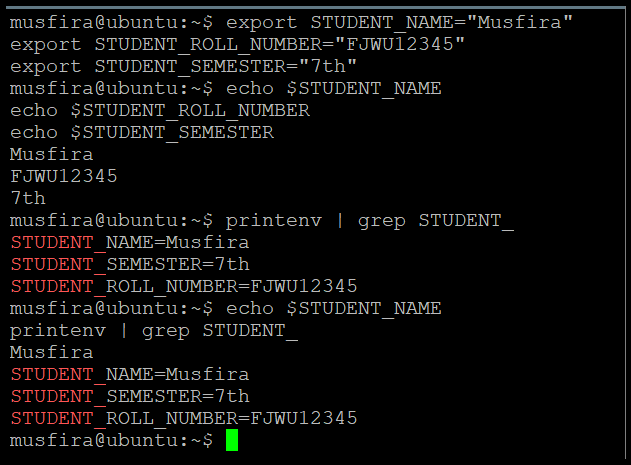

# ☁️ Cloud Computing — Lab 07  
### **Environment Variables, PATH, UFW, and SSH Key Authentication**

**Submitted By:** Musfira Farooq  
**Roll No:** 2023-BSE-045  
**Submitted To:** Sir Muhammad Shoaib  
**Class:** BSE (V-B)

---

## 🧩 Task 1 – Explore Environment Variables

### printenv_all  
.png)

### grep_shell_home_user  
.png)

---

## 🧩 Task 2 – Create Temporary Environment Variables

### exports_all  
.png)

### echoes_all  
.png)

### printenv_grep_db  
.png)

### after_restart_checks  
.png)

---

## 🧩 Task 3 – Persistent Environment Variables via ~/.bashrc

### bashrc_added  
.png)

### source_and_verification  
.png)

### after_restart_persistent  
.png)

---

## 🧩 Task 4 – PATH and System-wide Variables

### etc_environment_before  
.png)

### etc_environment_edit_vim  
.png)

### etc_environment_after  
.png)

### echo_path_before  
.png)

### echo_class_and_path  
.png)

### welcome_create_and_chmod  
.png)

### welcome_run_dot  
.png)

### bashrc_path_line  
.png)

### bashrc_source_and_welcome  
.png)

---

## 🧩 Task 5 – Configure UFW Firewall for SSH

### ufw_enable_and_status  
.png)

### ufw_deny_22_and_status  
.png)

### ssh_attempt_blocked  
.png)

### ufw_allow_reload_status  
.png)

### ssh_success_after_allow  
.png)

---

## 🧩 Task 6 – SSH Key Authentication

### windows_sshkey_and_list  
.png)

### windows_public_key  
.png)

### windows_known_hosts_cleared_and_empty  
.png)

### windows_ssh_accept_hostkey_and_login  
.png)

### windows_known_hosts_after_connect  
.png)

### server_clear_authorized_keys  
.png)

### server_add_key_and_show  
.png)

### ssh_passwordless_login  
.png)

### ssh_with_identity_file  
.png)

---

## 🧾 Exam Evaluation

### Q1 – Environment Variables (All)  
.png)

### Q1 – Environment Filters  
.png)

---

### Q2 – All Together  

---

### Q3 – Bashrc Editor  
.png)

### Q3 – After Restart  
.png)

---

### Q4 – UFW Enable Status  
.png)

### Q4 – UFW Deny Ping Status  
.png)

---

### Q4 – Ping Blocked  
.png)

---

### Q4 – UFW Allow Ping Status  
.png)

---

### Q4 – Ping Success  
.png)

