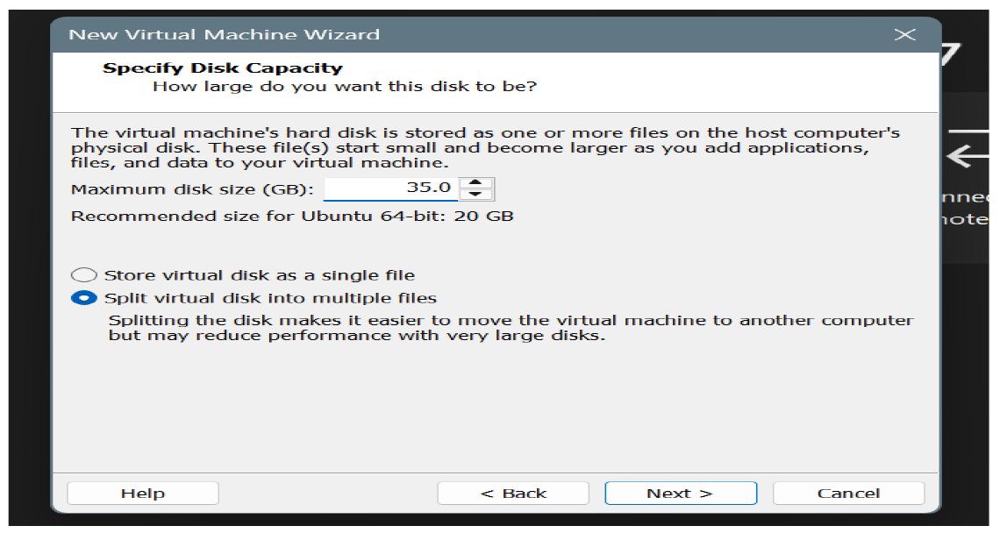

# Cloud Computing - Lab 01

### Course
BSE (V-B)

### Submitted By
- **Name:** Musfira Farooq  
- **Roll No:** 2023-BSE-045  

### Submitted To
- **Instructor:** Sir Muhammad Shoaib  

---

## Lab 01: Installation of Linux (Ubuntu)

### Step 1: Installation of VMware 17 Workstation Pro
- Download and install **VMware Workstation Pro 17**.
- **Screenshot:**  
  

### Step 2: Installation of Ubuntu 24.4.3
- Download the **ISO file** of Ubuntu (latest version).
- Create a new **Virtual Machine** in VMware.

- Attach the ISO file during setup.

- Power on the newly created virtual machine.
- **Screenshot:**  
 
  
  
  

 
- Complete the Ubuntu installation process.
- **Screenshot:**  
  

### Step 3: Run Network Command
- Run the `ip addr` command in the terminal to verify network configuration.
- **Screenshot:**  
  

### Step 4: Run SSH Command
- Use the `ssh` command in the terminal to test remote login functionality.
- **Screenshot:**  
  

---

✅ **Lab 01 Completed: Linux (Ubuntu) installation on VMware**
